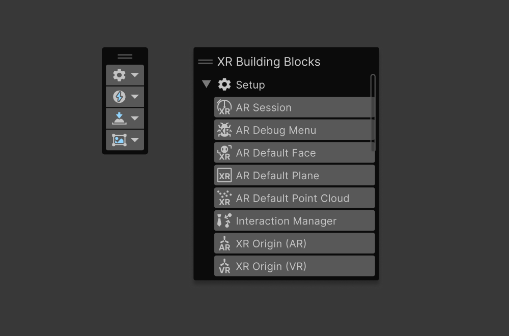

# Development & Iteration

## Prerequisites
Please refer to [visionOS Support Requirements & Limitations](Requirements.md) for information about supported hardware, software, and Unity features.

<!-- TODO: ## Package Setup Instructions -->

## Enable RealityKit mode
visionOS support for RealityKit is provided via Unity PolySpatial. When the active build target is visionOS and "RealityKit" or "Hybrid" is selected as the App Mode in **Edit &gt; Project Settings &gt; XR Plugin-in Management &gt; Apple visionOS &gt; App Mode**, PolySpatial is automatically enabled and configured for visionOS. If RealityKit or Hybrid is not selected as the App Mode, or on other platforms, PolySpatial is disabled.

## Iteration and Preview
When targeting visionOS RealityKit, Unity's regular play mode and build workflows are used. Additionally, visionOS RealityKit supports "Play to Device" for rapid iteration on actual hardware via play mode.

### Play Mode
The fastest way to preview content is to enter Play Mode within the Unity Editor. When targeting visionOS RealityKit, entering play mode will enable PolySpatial in the editor. A parallel hierarchy of GameObjects is created that represent the objects that will be visible on the PolySpatial target platform. When previewing in play mode in the editor, the preview is displayed from the viewpoint of the main Unity Camera. PolySpatial objects are created in the PolySpatial layer. To ensure you are viewing the end result objects, make sure the active camera's culling mask shows only PolySpatial objects. In the editor, PolySpatial will attempt to manage this for you directly, and will create and configure a mirror of the main camera.

When working with multiple volumes, the **Target Display** of each Volume Camera can be set to a different value, allowing you to cycle between volumes in the Game tab. See [Volume Camera](VolumeCamera.md) for more information.

When playing in the editor, Unity's rendering system is used instead of RealityKit, as it would be on visionOS. As such, it will not be a faithful representation of visuals or performance characteristics of visionOS.

### visionOS Player builds
Most options in build settings are analogous to those provided for iOS. visionOS player builds will generate an Xcode project that needs to be compiled on an Apple Silicon Mac, and may target either the visionOS simulator or an Apple Vision Pro headset. You must select either the Device SDK or the Simulator SDK in Player Settings in order to target the appropriate environment.

As with iOS, when building for a device, you must configure a valid provisioning profile and signing certificate in order to deploy the built application.

### Play to Device
Unity's visionOS RealityKit support includes **Play to Device**, a new workflow that allows you to enter Play Mode in the editor and instantly see your content on an attached device. You can inspect or make changes to your content live, and can provide input either via the device or the editor. See [Play To Device](PlayToDevice.md) for more information.

### Recording and Playback
PolySpatial-based platforms support a recording and playback workflow that allows you to record a session (including input commands) and then play it back within the Unity Editor. For more information, see information about [PolySpatial tooling](Tooling.md)

## Debugging Support
The standard debugging workflow works normally on visionOS. Enable **Script Debugging** in the Build Settings and optionally **Wait for Managed Debugger**. Then attach a managed debugger/IDE to your running application and debug your script code. Note: at the moment, **Wait for Managed Debugger**  will wait for 30 seconds (printing a message in the Xcode debugger console). There is no window as there is on iOS.

## Project Validation

Unity's visionOS RealityKit platform provides a way to validate your visionOS project before building and deploying to a device. Unsupported scene objects will be indicated by a warning icon in the Hierarchy view, while the Inspector view provides helpful UIs to navigate between these objects and address the issues. For detailed information about the validation system, please refer to the [Project Validation](PolySpatialXRProjectValidation.md) page.

## Building Blocks in PolySpatial XR

The Building Blocks system is an overlay window in the Scene view that can help you quickly access commonly used items in your project. To open the Building Blocks overlay click on the hamburger menu on the Scene view &gt; Overlay menu. Or move the mouse over the Scene view and press the "tilde" key. Afterwards, just enable the Building Blocks overlay.

You can find more info about the building blocks system in the [XR Core Utils package](https://docs.unity3d.com/Packages/com.unity.xr.core-utils@latest).
