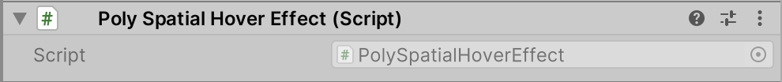

# PolySpatial Hover Effect

This component provides a hint to the platform to apply a system hover effect when the user is hovering over this object. This is typically used to provide a visual cue to the user that the object is interactive. This effect gets triggered by gaze or a hand poke. The effect is applied to the object that is being hovered over, and not the object that is doing the hovering.

For privacy reasons, visionOS does not permit apps access to user gaze directly. However, it is often helpful to visually highlight objects at which the user is gazing in order to hint which object will receive input if the user performs a pinch gesture. To this end, Unity PolySpatial provides a `PolySpatialHoverEffect` component for visionOS, which can be added to GameObjects that might receive input via gaze. The presence of this component instructs the host platform (RealityKit) to apply a coloration effect to `GameObject`'s `MeshRenderer` any time the user's gaze ray intersects its corresponding collider(s). 

All three components must be present to achieve an effect: the `PolySpatialHoverEffect` indicates a `GameObject` should display hover, a `Collider` component defines the collision shape against which the gaze ray is cast, and the `MeshRenderer` provides the mesh and geometry on which the coloration affect will be applied.

