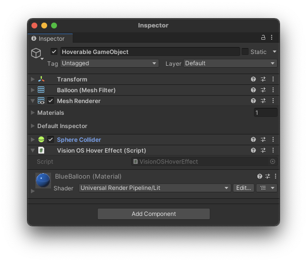

# Hover Effects

The **VisionOSHoverEffect** component provides a hint to the platform to apply a system hover effect when the user is hovering over this object. This is typically used to provide a visual cue to the user that the object is interactive. This effect gets triggered by gaze or a hand poke. The effect is applied to the object that is being hovered over, and not the object that is doing the hovering.

For privacy reasons, visionOS does not permit apps access to user gaze directly. However, it is often helpful to visually highlight objects at which the user is gazing in order to hint which object will receive input if the user performs a pinch gesture. To this end, Unity PolySpatial provides a `VisionOSHoverEffect` component for visionOS, which can be added to GameObjects that might receive input via gaze. The presence of this component instructs the host platform (RealityKit) to apply a coloration effect to `GameObject`'s `MeshRenderer` any time the user's gaze ray intersects its corresponding collider(s). 

Three components must be present to achieve the hover effect: 

* A `VisionOSHoverEffect` component indicates that the `GameObject` and its descendants should display an effect when hovered.
* A `Collider` component on the same `GameObject` as the `VisionOSHoverEffect` defines the collision shape against which the gaze ray is cast.
* A `MeshRenderer` provides the mesh and geometry on which the coloration affect is applied.  The `MeshRenderer` may be on the `GameObject` containing the `VisionOSHoverEffect` and `Collider` components or on any of its descendants.

The `VisionOS Hover Effect` component contains following properties:

| **Property** | **Description** |
| --- | --- |
| **Type** | The type of hover effect to use: `Spotlight` for a spotlight around the hovered position, `Highlight` for the spotlight effect plus a uniform highlight, or `Shader` for a hover effect defined by the `PolySpatial Hover State` node. |
| **Color** | The color of the effect, when using the `Spotlight` or `Highlight` types. |
| **Intensity Multiplier** | The intensity of the effect, when using the `Spotlight` or `Highlight` types. |
| **Fade In Duration** | The duration in seconds over which the effect fades in, when using the `Shader` type. |
| **Fade Out Duration** | The duration in seconds over which the effect fades out, when using the `Shader` type. |

## Skinned Mesh Renderers
To display a hover effect on `SkinnedMeshRenderer` components, the `VisionOSHoverEffect` and `Collider` components must be present on the parent of the `SkinnedMeshRenderer` GameObject (or any of its ancestors).

## PolySpatial Hover State shader graph node
Within shader graphs, the hover state may be accessed using the `PolySpatial Hover State` node.  This node provides the following outputs:

| **Output** | **Type** | **Description** |
| --- | --- | --- |
| **Intensity** | Float | The current hover intensity.  This fades in and out according to the `Fade In Duration` and `Fade Out Duration` properties. |
| **Position** | Vector 3 | The position of the hover point. |
| **Time Since Hover Start** | Float | The time in seconds since the hover effect started. |
| **Is Active** | Boolean | Whether or not the hover effect is currently active. |

## UGUI Selectable hover transitions
On visionOS, hover transitions for certain `Selectable` objects (`Button`, `Dropdown`, `TMP_Dropdown`, `InputField`, `TMP_InputField`, `Scrollbar`, `Slider`, and `Toggle`) are automatically handled by adding a hover effect component to the Selectable's `targetGraphic` and using the `PolySpatial Hover State` shader graph node in the PolySpatial UI image shader graph (`Packages/PolySpatial/Resources/Shaders/MaskingShader.shadergraph`) to switch between the normal `Color` and a separate `HoverColor` property.  Note that only `Color Tint` transitions are supported for hover through this method and that any custom UI shaders (that is, shaders other than `UI/Default`) must replicate the properties and hover state functionality of `MaskingShader` in order to show transitions on hover.
