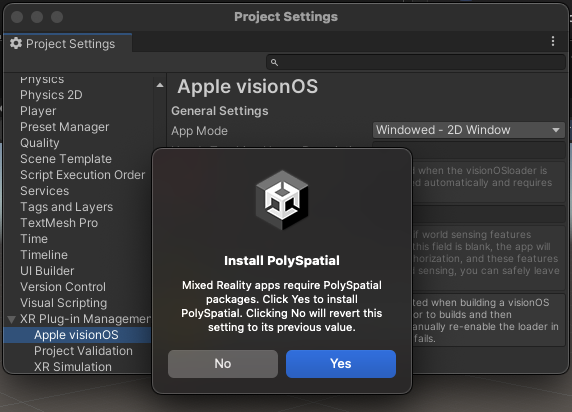

# Install PolySpatial and visionOS support

You can choose three different modes for an app you develop for the visionOS platform. Each mode has different requirements for the modules and packages you must install in your project:

**Windowed apps**

You can develop Windowed apps for visionOS by [installing the visionOS Platform module](#install-the-visionos-platform-module) in the Unity Hub. All Unity developers can create windowed apps using the visionOS module. No additional packages or specific Unity subscription type is required.

Refer to [Windowed Apps in visionOS](WindowedApps.md) for more information about developing windowed apps.

**Metal apps**

To develop Metal apps for visionOS, you must:

* [Install the visionOS platform module](#install-the-visionos-platform-module)
* [Install the XR packages](#install-the-xr-packages)

You must also set the visionOS **App Mode** to **Metal Rendering with Compositor Services**.
You can access this setting in the **Apple visionOS** section under **XR Plug-in Management** in your **Project Settings**.

Refer to [Metal-based Apps on visionOS](MetalApps.md) for more information about developing Metal apps.

**RealityKit apps**

To develop RealityKit apps for visionOS, you must install the PolySpatial packages in addition to the visionOS platform module and the XR packages:

* [Install the visionOS platform module](#install-the-visionos-platform-module)
* [Install the XR packages](#install-the-xr-packages)
* [Install the PolySpatial packages](#install-the-polyspatial-packages)

You must also set the visionOS **App Mode** to **RealityKit with PolySpatial**.
You can access this setting in the **Apple visionOS** section under **XR Plug-in Management** in your **Project Settings**.

Refer to [RealityKit apps on visionOS](RealityKitApps.md) for more information about developing RealityKit apps.

**Hybrid apps**

A hybrid app can switch between Metal and RealityKit mode. Hybrid apps have the same package requirements as RealityKit apps. To develop Hybrid apps for visionOS, you must:

* [Install the visionOS platform module](#install-the-visionos-platform-module)
* [Install the XR packages](#install-the-xr-packages)
* [Install the PolySpatial packages](#install-the-polyspatial-packages)

You must also set the visionOS **App Mode** to **Hybrid - Switch between Metal and RealityKit**.
You can access this setting in the **Apple visionOS** section under **XR Plug-in Management** in your **Project Settings**.

Refer to [RealityKit apps on visionOS](RealityKitApps.md) for more information about developing RealityKit apps.

> [!IMPORTANT]
> Developing XR apps using Metal, RealityKit or Hybrid for the visionOS platform requires a Unity Pro, Enterprise, or Industrial subscription.

## Prerequisites

Refer to [Requirements](Requirements.md) for information about the hardware and software required to develop apps for visionOS using Unity.

## Install the visionOS platform module

Refer to [Add modules](https://docs.unity3d.com/hub/manual/AddModules.html) in the Unity Hub documentation for instructions on adding modules to your Editor install.

If you only install the visionOS platform module, all apps that you develop for visionOS automatically launch in windowed mode.

## Install the XR packages

Before you install the XR packages, you must [Install the visionOS platform module](#install-the-visionos-platform-module).

To install the visionOS XR packages:

1. Open your project in the Unity Editor.
2. Open the **Project Settings** window (menu: **Edit &gt; Project Settings**).
3. Select the **XR Plug-in Management** section.
4. If you see a notice about installing the XR Plug-in Management package, click the button to install it.
5. Select the visionOS tab.
6. Under **Plug-in Providers**, enable **Apple visionOS**.

> [!IMPORTANT]
> To see the **Apple visionOS** provider, you must have version 4.4.1 (or later) of the XR Plug-in Management package installed. Use the **Package Manager** window (menu: **Window &gt; Package Manager**) to update the package, if necessary.

When you enable the **Apple visionOS** provider, the Unity Package Manager installs the following packages:

* [Apple visionOS XR Plugin](https://docs.unity3d.com/Packages/com.unity.xr.visionos@1.0/manual/index.html) (`com.unity.xr.visionos`)
* [AR Foundation](https://docs.unity3d.com/Packages/com.unity.xr.arfoundation@latest) (`com.unity.xr.arfoundation`)
* [XR Core Utilities](https://docs.unity3d.com/Packages/com.unity.xr.core-utils@latest) (`com.unity.xr.core-utils`)

Additional packages in the project might be updated during the install process if required to satisfy version dependencies.

After you install the Apple visionOS XR Plugin, you can choose whether your app launches in Metal or windowed mode with the **App Mode** setting. You can access this setting in **Apple visionOS** section under **XR Plug-in Management** in your **Project Settings**. If you choose one of the remaining options, **RealityKit with PolySpatial** or **Hybrid - Switch between Metal and RealityKit**, Unity offers to install the PolySpatial packages for you.

> [!NOTE]
> You cannot change **App Mode** at runtime. For example, you cannot launch an app in Windowed mode and then change to Metal, RealityKit, or Hybrid mode.

## Install the PolySpatial packages

Before you install the PolySpatial packages, you must [Install the visionOS platform module](#install-the-visionos-platform-module) and [Install the XR packages](#install-the-xr-packages).

To install the PolySpatial packages:

1. Open the **Project Settings** window (menu: **Edit &gt; Project Settings**).
2. Select the **Apple visionOS** settings under **XR Plug-in Management**.
3. Change the **App Mode** setting to **RealityKit with PolySpatial** or **Hybrid - Switch between Metal and RealityKit**.

   Unity offers to install the PolySpatial packages, which are required to support the RealityKit and hybrid app modes.

   

4. Choose **Yes**.

Unity installs the following packages:

* [PolySpatial](xref:psl-index) (com.unity.polyspatial)
* [PolySpatial XR](xref:psl-xr-index) (com.unity.polyspatial.xr)
* [PolySpatial visionOS](index.md) (com.unity.polyspatial.visionos)

