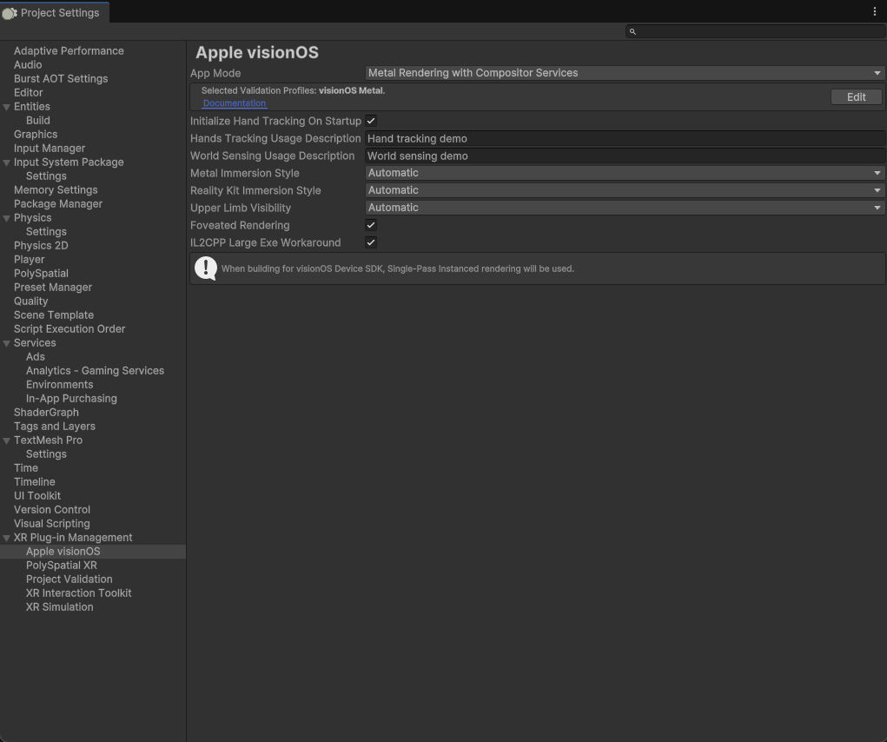

# Metal-based Apps on visionOS

With Unity, users can leverage familiar workflows to build Metal-based apps using [**Compositor Services**](https://developer.apple.com/documentation/compositorservices) for visionOS, allowing users to create [fully immersive](https://developer.apple.com/documentation/visionOS/creating-fully-immersive-experiences) or mixed immersion experiences. Today, Unity provides a wide [range of features and APIs](https://docs.unity3d.com/Manual/VROverview.html) that can be used to develop experiences for visionOS. Such packages include:

[//]: # (TODO: LXR-3988 Once visionOS plug-in docs page is created, link the below to that docs page.)
* visionOS plug-in
* [XR Interaction Toolkit](https://docs.unity3d.com/Manual/VROverview.html#xr-interaction-toolkit)
* [XR Core Utilities](https://docs.unity3d.com/Manual/VROverview.html#xr-core-utilities)
* [Input System](https://docs.unity3d.com/Manual/VROverview.html#input-system)
* [VR project template](https://docs.unity3d.com/Manual/VROverview.html#vr-template)
* [Hand tracking](https://docs.unity3d.com/Manual/VROverview.html#hand-tracking)

To get started, simply select **Apple visionOS** on the **XR Plug-in Management** window in **Project Settings**, then navigate to the **Apple visionOS** project setting below **XR Plugin-in Management**.

Set the App Mode to **Metal Rendering with Compositor Services**. If you are using ARKit features, you may also need to set a **Hands Tracking Usage Description** and/or a **World Sensing Usage Description**.

The [visionOS project settings](VisionOSSettings.md) menu has a few properties pertaining to the **Metal Rendering with Compositor Services** app mode.

After modifying the visionOS settings, select and build for the visionOS platform in the **Build Profiles** menu. This will generate a Unity XCode Project. From here on, you'll continue the build process in the XCode project, debugging in XCode as needed.

>Please note that Unity is still building towards feature parity with the Metal API on XCode, so you might observe warnings from Metal’s API validation layer. To work around this, you can turn off the Metal API Validation Layer via XCode’s scheme menu.

### Pass-through Video in Metal Mode
With visionOS 2, apps set to **Metal Rendering with Compositor Services** can now show pass-through instead of just the skybox. The steps for enabling pass-through with Metal-based apps are the same as the steps for enabling pass-through with [Hybrid](PolySpatialHybridApps.md) apps.

1. Set the **Metal Immersion Style** under the **Apple visionOS** project setting to **Mixed** or **Automatic**.
2. Set your Unity **Camera**'s **Background Type** to **Solid Color**.
3. Under **Background Type**, click on **Background**. Set the RGBA values for the background color to 0. You can technically use any color here, but ensure the **Alpha** value is set to 0.

You may switch **Background Type** from **Solid Color** to **Skybox** in order to switch from showing pass-through to showing the skybox, and vice-versa.

> [!NOTE]
> When you set **Background Type** to **Skybox** (both in the Inspector and via scripting API), Unity will change the alpha value of the background color to 1. When you switch back to pass-through, you must _also_ set the background color to something transparent.

> [!NOTE]
> You will need to disable **HDR** on your **Universal Render Pipeline Asset** to get pass-through to work.

## Porting VR experiences to visionOS
For users who are looking to port existing VR titles looking to visionOS as a fully immersive experience there are a few things you can do to make the transition smoother, in addition to the build workflow elaborated in the above section.

### 1. Prepare your graphics
**Use Universal Render Pipeline (URP)** - visionOS supports Foveated Rendering, a technique that provides a higher-quality visual experience for users on the Vision Pro. To take advantage of the Foveated Rendering feature, we recommend URP, which allows for Foveated Rendering to be applied throughout the entire pipeline. We also plan to focus future improvements on URP specifically.

**Leverage Single-Pass Instanced Rendering** - Unity’s Single-Pass Instanced Rendering now supports the Metal Graphics API and will be enabled by default. This reduces the overhead of certain parts of the rendering pipeline like culling and shadows, and also helps to reduce CPU overhead when rendering your scenes in stereo.

**Ensure depth-buffer for each pixel is non-zero** - on visionOS, the depth buffer is used for reprojection. To ensure visual effects like skyboxes and shaders are displayed beautifully, ensure that some value is written to the depth for each pixel.

**Check Project Validation** - there are a number of settings and scene configuration details that you will need for your app to function properly. They will be listed under `Project Settings > XR Plug-in Management > Project Validation` under the visionOS platform tab. If you see any issues, you can click `Fix` or `Fix All` to automatically resolve them. Some specific issues to look out for:
- The `Apple visionOS` loader must be enabled
- Your scene needs an `ARSession` in addition to the normally required `TrackedPoseDriver` for head tracking to work
- All cameras need a depth texture (you should enable `Depth Texture` in your URP settings)
- The only supported `Depth Texture Mode` (setting on `UniversalRenderer`) is `AfterOpaques`

### 2. Adapt your controller-based interactions to hands
**Leverage the XR Interaction Toolkit (XRI)** - With visionOS, people will use their hands and eyes to interact with content. XRI provides a high-level interaction that abstracts implementation of hand-tracking and makes it easy to implement interactions like hover, grab and select in 3D space and in the UI for 3D spatial worlds. With XRI, you can also implement visual feedback for input, and its abstraction of input also makes it possible to author once, for multiple platforms.

**Dive into Unity Hands package** - If you’re looking to access even more flexibility in your input actions, Unity’s Hands Subsystem provides access to all the raw hand joint data via the Unity Hands Package.You can also learn about leveraging the Unity Hands Package for immersive experiences above.

For more information on porting your VR experience to visionOS, we recommend watching this guide to “[Bring your Unity VR app to a fully immersive space](https://developer.apple.com/videos/play/wwdc2023/10093)”.
