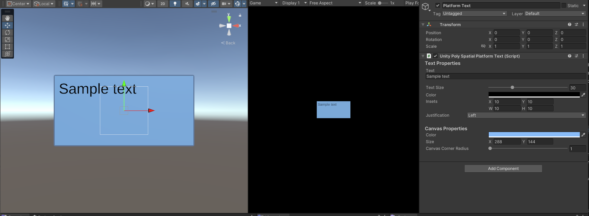

# Platform Text Rendering

PolySpatial supports text rendering across all platforms using the [TextMesh Pro](https://docs.unity3d.com/Manual/com.unity.textmeshpro.html) package. PolySpatial uses the material for the assigned font and a mesh generated by TextMesh Pro to create an item renderable on any platform. This works fine as a general mechanism, but limits the ability of the developer to leverage platform specific text rendering features or support.

To address this, PolySpatial provides a new `UnityPolySpatialPlatformText` component that you can add to a `GameObject` instance. This component will allow you to leverage some platform specific features for text rendering, as well as support for direct platform rendering. Not all features in the component will be supported on all platforms, but PolySpatial makes a best effort attempt to match as much as possible to keep a high level of fidelity.

It's important to note that this component is not in any way compatible with `TextMesh Pro`. You will need to decide if you want to use one or the other. Any attempt to assign them both to the same `GameObject` will result in an error, and the removal of the PolySpatial component.

## Platform Text Component Features

The `UnityPolySpatialPlatformText` component provides the following features:

| Feature | Description                                                                                                                                                                               |
|---------|-------------------------------------------------------------------------------------------------------------------------------------------------------------------------------------------|
|Text| The text to be displayed.                                                                                                                                                                 |
|Text Size| The size of the text, in points.                                                                                                                                                          |
|Text Color| The color to use to render the text.                                                                                                                                                      |
|Insets| Left, Top, Right and Bottom margin insets from the edges of the canvas. Used to provide some buffer around the text.                                                                      |
|Justification| The justification to use for the text. Possible Values are Left, Center, Right, Justified and None.                                                                                       |
|Canvas Size| The width and height of the canvas, in points. **NOTE** Not currently supported for Unity platform rendering.                                                                             |
|Canvas Corner Radius| The size of the radius used to generate rounded corners on the canvas.                                                                                                                    |
|Canvas Background Color| The color of the canvas.                                                                                                                                                                  |
|Font| The font used to render the text. **NOTE**: Currently the component is limited to using the default platform font for rendering. Support for font selection will come in a later release. |
