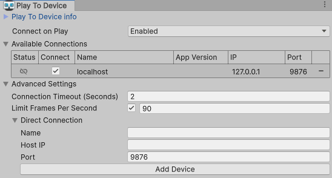
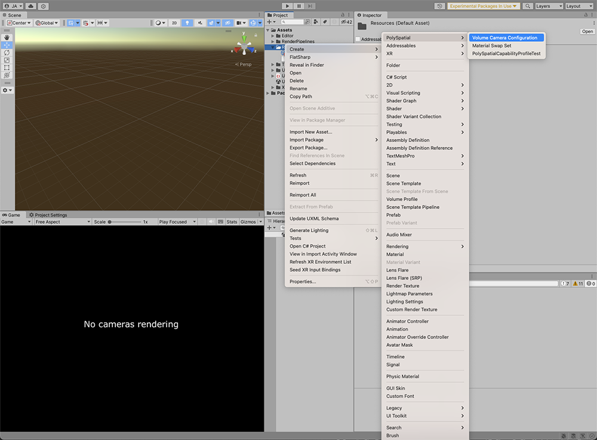
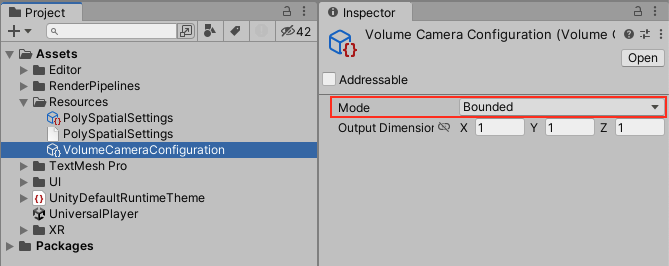
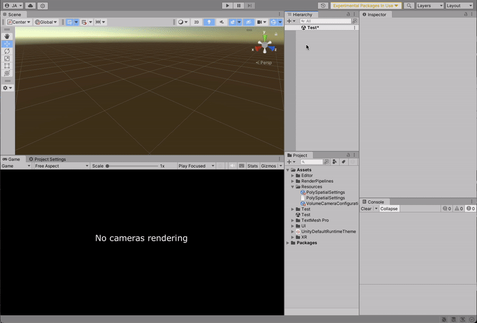
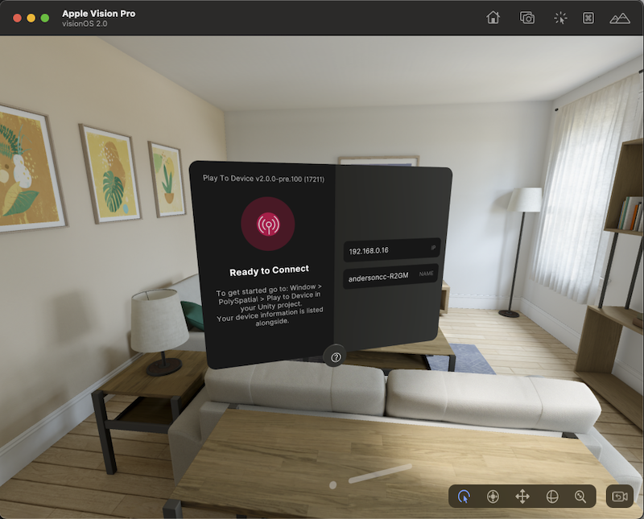

# Preview an Application with the Play To Device App

## The Play To Device App

The Play To Device app is a downloadable application that helps with visionOS development. It connects your Apple's visionOS Simulator and/or Vision Pro device to the Unity Editor and displays the visual output from the Editor on the target's device screen. This speeds up iteration time by allowing you to see how a shared world application looks and feels on the target device without creating a build.

### Requirements and compatibility 

The Play To Device App supports the following platforms:
- visionOS Simulator
- Vision Pro device

### Setting up the Play To Device feature

To set up the Play To Device feature Open the Play to Device Window by clicking on **Window > PolySpatial > Play To Device** and make sure:

- The Play To Device application is installed from Test Flight App by selecting **Download The TestFlight App** link **(A)**.
- Once installed, open the Play To Device App in either your visionPro or Apple's visionOS Simulator.
- Make sure **Connect To Player On Play Mode** is toggled **on** in the Play To Device Editor Window **(B)**. 
- Use the IP address displayed to manually input the IP in the Play To Device Editor Window in the Unity Editor **(C)**.

### Troubleshooting Connection

- Make sure both the host machine and the mobile device are connected to the same WiFi network
- Make sure your firewall is not blocking the connection. If it is, then you may have to temporarily disable it using the appropriate tool for your OS.

## Previewing a small cube in the Play To Device App

To preview an application in the Play To Device App:

1. Create a new volume camera configuration asset by right clicking in the project view and selecting **Create > PolySpatial > Volume Camera Configuration**.

**Note:** Make sure the `Volume Camera Configuration` asset is in the `Resources` folder.
2. Set the created volume camera configuration _mode_ to `Bounded`

3. On a new empty scene create an Empty game Object, add a volume camera component to it and set the Volume camera configuration to the one just created.

4. Create a small cube in the scene and place it inside the volume camera bounds.

5. Open the Play To Device App in either the visionOS Simulator or a Vision Pro device.

6. Open the Play To Device _Editor Window_ and make sure **Connect To Player On Play Mode** is toggled on. To no longer stream to the Play To Device and return to Game View, simply turn off the **Connect To Player On Play Mode** property in the Play To Device Editor Window.

7. With the Play To Device App open, click the Play button in the Editor to see the application appear in the app.

