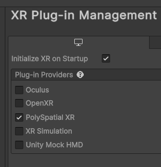
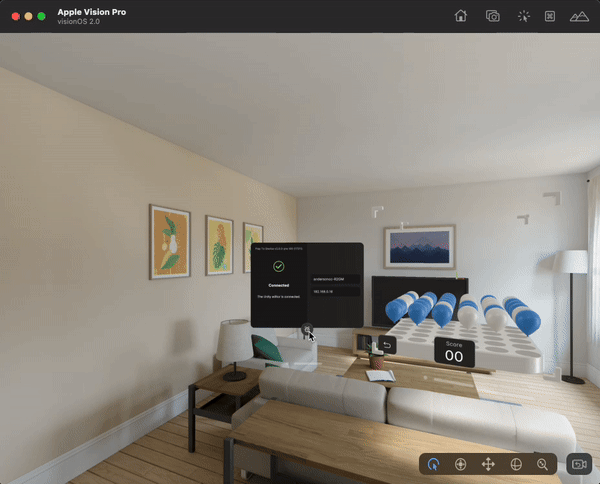

# Play to Device

The Play to Device feature drastically improves iteration and debugging workflows. it enables you to:

* Iterate efficiently and preview your content live in the Unity editor, the visionOS simulator, and the Apple Vision Pro device
* Deploy your content without rebuilding a Xcode project
* Access Unity editor’s play mode features on the visionOS simulator and Apple Vision Pro device

This feature is delivered through the Play to Device Host application, which can be installed on the visionOS Simulator or an Apple Vision Pro device. With the Play to Device host running, you can press Play in the Unity Editor and see your content appear in the simulator or on device, rendered by RealityKit. No intermediate builds are required.

Any changes you make in Unity Editor - such as creating game objects, modifying inspector values, updating and recompiling shader graphs, etc. - will be synchronized to the simulator/device in real time, and any interactions you perform on the host will be synchronized back to the editor.

## Requirements

Depending on how you are running your application, you will need to install the Play to Device Host on either the visionOS Simulator or an Apple Vision Pro device.

* To run the Play to Device Host on the _visionOS simulator_, you can find the Xcode .app files in the [following link](https://drive.google.com/drive/u/0/folders/1ZmWoS6NhrrmvabYia79hlvbyPV1mUN2p).
* To run the Play to Device Host on an _Apple Vision Pro device_, you can find the TestFlight link below:

  * If you are using 1.x PolySpatial package version use [this link](https://testflight.apple.com/join/FVMH8aiG).
  * If you are using 2.x PolySpatial package version use [this link](https://testflight.apple.com/join/15PwZO6I).

**It is important to note that the Play to Device Host must match your PolySpatial package version exactly.** Refer to the [Compatibility Matrix](https://discussions.unity.com/t/play-to-device/309359#version-compatibility-matrix-1) for more information about the specific editor versions supported depending on the PolySpatial package version you are running.

## First Time Setup - visionOS Simulator

To install the host app for the visionOS simulator:

1. Download the “**PlayToDeviceHost.app.zip**” to your Apple Silicon Mac. See the Compatibility Matrix above to identify the right version given your PolySpatial version.
2. Extract the zip file revealing “**PlayToDeviceHost.app**” in Finder.
3. Start the visionOS simulator, either by going to **“Xcode > Open Developer Tool > Simulator**” within Xcode, or using Spotlight (command+space) and typing “simulator”.
4. When the simulator is running, you can see the home screen with various app icons. Drag “**PlayToDeviceHost.app**” from the Finder window into the simulator window.
5. After a few seconds, you should see “**PlayToDeviceHost**” appear as one of the app icons on the home screen. Note that you may have to scroll the app list to see it.

## First Time Setup - Apple Vision Pro Hardware

To install the host app for an Apple Vision Pro device:

1. Follow the TestFlight invite link in Safari on the device. You should see an invite code. See the **Compatibility Matrix** above to access a link compatible with your PolySpatial version.
2. Open the TestFlight app on your Apple Vision Pro device, signing into your Apple account if necessary.
3. Tap “**Redeem Code**” in the TestFlight app.
4. Enter the code you saw in your browser after following the invite link.
5. Tap “**Download**” in the TestFlight app after reading the build information and release notes.
6. After a few seconds, either tap “**Open**” from TestFlight or navigate to the Play To Device Host application that now appears on your home screen.

## First Time Setup - Unity Editor

Once you've installed a host app for device or simulator (see above):

1. Launch the PlayToDeviceHost app in your device or the Apple VisionOS simulator.
2. In the Unity Editor, open the Play to Device Editor window via the main menu under  \
**Window > PolySpatial > Play to Device**.
3. If the Play to Device host app is running locally on the same machine (such as with the visionOS simulator), its connection will be automatically detected and you can jump to step **4**. Otherwise, follow the steps below to add a direct connection:
   1. Open the **Direct Connection** section inside the **Advanced Settings** foldout.
   2. Set a **Host Name** that uniquely identifies the host app for you.
   3. Insert the IP address and port that maps to the host app launched at step **1**.
   4. Click the **Add Device** button.
4. Select the desired host app(s) to connect by checking the **Connect** toggle in the **Available Connections** list.
5. Make sure that **Connect on Play** is **enabled**.
6. Enter **Play mode** in the Unity Editor. The Unity Editor will attempt to connect to the host. If it cannot find or connect to the host, the Editor will continue attempting to connect for a number of seconds, as determined by the connection timeout setting in **Advanced Settings**. A cancellable progress bar will be displayed while the Editor attempts to connect - hit cancel on the progress bar during this phase to stop further connection attempts.
7. Once connected, the Unity Editor will begin streaming your experience to the host in real time. You can then view, play, or interact with your experience via either editor or device; changes and interactions will automatically stay in sync. The volume containing the connection panel will remaining alongside the volume(s) containing your content. This volume contains the [Auxiliary Menu](#auxiliary-menu).

If you notice that your connection is timing out, you can increase the connection timeout in the **Advanced Settings** of the Play To Device Editor Window. The default timeout is 5 seconds.

**NOTE**: If you select multiple connections at once, content will be streamed to all selected hosts simultaneously.

**NOTE**: Limit Frames Per Second should be enabled and set to the expected framerate on device. If the editor runs significantly faster than the device it can overload the network with unnecessary messages making Play To Device feel unresponsive.

**NOTE**: Your project's **App Mode** must be set to `RealityKit with PolySpatial` in order to use Play To Device. You can access this setting in the **Apple visionOS** section under **XR Plug-in Management** in your **Project Settings**.

## Subsequent Usage

After initial setup, your content will be synced to the host app each time you press play, as long as the **Connect on Play** is **enabled**, and the host remains live.

## AR visualization in editor

Augmented Reality (AR) data can be streamed from the device to the editor, allowing AR-dependent applications to be previewed with Play To Device. To enable this functionality go to `Project Settings` > `XR Plug-in Management`.
Under the Standalone target look for  `Plug-in Providers` turn on `PolySpatial XR`.  Make sure to disable `XR Simulation` if it is on.

The following AR features are supported:
* Hand Tracking
* AR Planes
* AR Meshes
* AR Tracked Images

The typical limitations for PolySpatial AR will apply here - the scene must have an AR Session and a VolumeCamera in Unbounded mode.

## Auxiliary Menu

The auxiliary menu has been temporarily removed. Instead, a panel will appear when PlayToDevice opens. This panel features a button that allows you to launch the console log in your spatial environment in order to debug your application faster.

[//]: # (The auxiliary menu provides additional functionality for your play-to-device session such as:)

[//]: # (* Ability to visualize the bounds of your volume camera while testing using a toggle.)

[//]: # (* Ability to launch the console log in your spatial environment in order to debug your application faster.)

[//]: # (![AuxMenuWireFrame.gif]&#40;images/PlayToDevice/AuxMenuWireframe.gif&#41;)

[//]: # (![AuxMenuConsoleLog.gif]&#40;images/PlayToDevice/AuxMenuConsoleLog.gif&#41;)

[//]: # ()
[//]: # (In addition, you can dock the auxiliary menu’s position at the edges of the volume to avoid overlapping content inside the shared world app volume. In order to move the menu, drag the handle to the edges of the volume using gaze + pinch input. The menu will stay in the same position in future sessions.)

[//]: # ()
[//]: # (![AuxMenuAnchors.gif]&#40;images/PlayToDevice/AuxMenuAnchors.gif&#41;)

## Troubleshooting

For troubleshooting issues refer to the [Play to Device troubleshooting section in the FAQ](FAQ.md#play-to-device-host).

## Tutorial: Previewing a cube

To preview an application in the Play To Device host:

1. Create a new volume camera configuration asset by right clicking in the project view and selecting **Create > PolySpatial > Volume Camera Configuration**.

   

   **Note:** Make sure the `Volume Camera Configuration` asset is in the `Resources` folder.

2. Set the created volume camera configuration _mode_ to `Bounded`.

   

3. On a new empty scene create an Empty game Object, add a volume camera component to it and set the Volume camera configuration to the one just created.

   

4. Create a small cube in the scene and place it inside the volume camera bounds.

   

5. Open the Play To Device host in either the visionOS Simulator or an Apple Vision Pro device.

   

6. Open the Play To Device _Editor Window_ and make sure **Connect on Play** is enabled. Also make sure that the connection to the host is enabled in **Available Connections**.

7. With the Play To Device host open, click the Play button in the Editor. The application should begin running both within the editor and in the host app.

## Upgrading/Downgrading TestFlight versions of Play to Device

As explained above, you must use a version of the Play to Device Host app that matches the version of the PolySpatial packages used in the Editor. This means that you may need to upgrade/downgrade the version of the app on your device depending on the version of PolySpatial you have in your project. When using the link to install the app for the first time, the latest version will be installed.

* To upgrade to the latest version, simply open the TestFlight app, find `Unity Play to Device Host` in the list, and tap `Upgrade`.
* To downgrade or upgrade to any version other than the latest, tap the title of the `Unity Play to Device Host` app. This will bring you to a new view with more information.
  * In the app details view, tap `Previous Builds`.
  * Tap the version number which corresponds to the version of PolySpatial in your project.
  * In the build details view, tap `Install`.

You can find more information about TestFlight and how to test previous builds in the [official documentation](https://testflight.apple.com/#testing-previous-builds).

## Limitations of using Play To Device

Even though the Play to Device feature is a powerful tool for iterating on your content, it will not replace how some features will work in a real device. Here are some limitations to keep in mind:

* Video Component: The [VisionOSVideoComponent](VideoComponent.md#visionosvideocomponent) may not work as expected when connected to a PlayToDevice host. Over a network, the VisionOSVideoComponent will not work, while the Unity VideoPlayer component will work, albeit with a performance cost.
* PlayToDevice may incur a performance hit when using render textures, and render textures may render slowly or may stutter while connected.
* Play to Device may not be able to accommodate your `VolumeCamera`'s specific `Output Dimension`. The number of available `VolumeCamera` window sizes (`OutputDimension`) is limited in PlayToDevice, and PlayToDevice will attempt to match user requested dimensions to available window sizes.
* Object tracking is not supported in the Play to Device app.
* XR Meshes over windows are not supported over Play to Device.