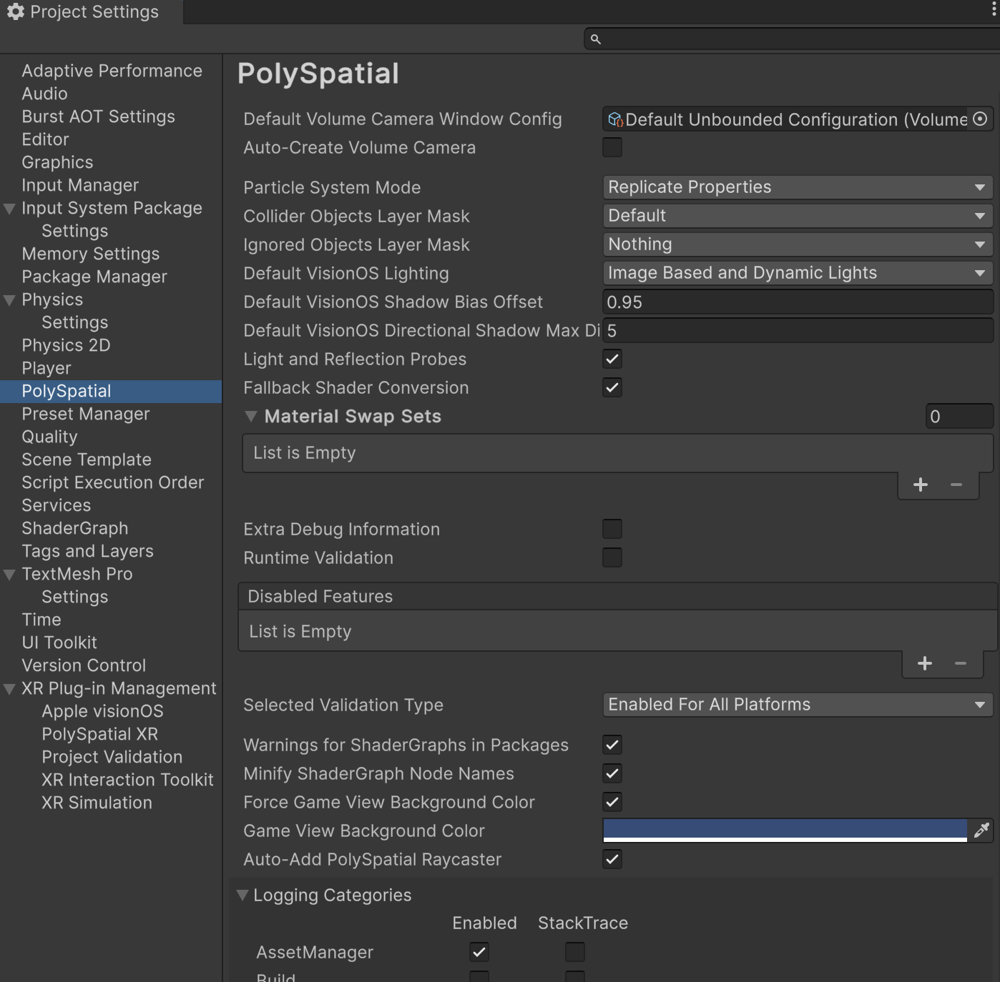

# PolySpatial Settings

To access the PolySpatial Settings window, go to: `Edit > Project Settings > PolySpatial Settings` in the Unity Editor. 

The following settings are available:

| Setting                               | Description                                                                                                                                                                                                                                                                                                                                      |
|---------------------------------------|--------------------------------------------------------------------------------------------------------------------------------------------------------------------------------------------------------------------------------------------------------------------------------------------------------------------------------------------------|
| Default Volume Camera Window Configuration | Specifies the default [`Volume Camera Window Configuration`](VolumeCamera.md#volume-camera-window-configuration-assets) to be used when no configuration is set on a Volume Camera component. This also determines the start-up scene for the application. For example, a project with the default Unbounded Volume Camera Window Configuration will start with an `ImmersiveSpace`, hiding other applications and the virtual environment.                                                                                                                                                          |
| Auto-Create Volume Camera             | When enabled, if there is no Volume Camera present during any frame, a Volume Camera is created using the default settings. Disable this to directly manage all Volume Camera aspects, such as creating Volume Camera from a script.                                                                                                             |
| Particle System Mode                  | How particle systems are handled:  - **[Replicate Properties:](SupportedFeatures.md#supported-modes)** Unity particle system properties are mapped to native particle system properties.  - **[Bake to Mesh:](SupportedFeatures.md#supported-modes)** Particle systems are baked to a mesh every frame and rendered as regular meshes.  - **[Bake to Texture:](SupportedFeatures.md#supported-modes)** Particle systems are baked to a texture every frame and rendered as meshes using a vertex shader. |
| Collider Objects Layer Mask           | Only Colliders in these layers are replicated to the target for input.                                                                                                                                                                                                                                                                           |
| Ignored Objects Layer Mask            | GameObjects in these layers are be replicated to the target.                                                                                                                                                                                                                                                                                     |
| Default VisionOS Lighting | The default kind of lighting/shadowing to use for standard lit materials on visionOS:  - **[Image Based Only:](PolySpatialLighting.md#visionos-light-settings)** Only use lighting from environment.  - **[Image Based and Dynamic Lights:](PolySpatialLighting.md#visionos-light-settings)** Also use point/spot/directional lights.  - **[Image Based, Dynamic Lights, and Shadows:](PolySpatialLighting.md#visionos-light-settings)** Also use point/spot/directional lights and spot/directional shadows. |
| Default VisionOS Shadow Bias Offset | The default additional fixed bias to add to shadows on visionOS. |
| Default VisionOS Directional Shadow Max Distance | The default maximum distance from the camera to render directional shadow maps on visionOS. |
| Light and Reflection Probes           | Replicate light and reflection probes. **Warning**: Enabling this option can have a large performance impact.                                                                                                                                                                                                                                    |
| Fallback Shader Conversion            | When enabled, a number of legacy built-in shaders are replicated on a best-effort basis.                                                                                                                                                                                                                                                         |
| Material Swap Sets                    | The list of Material Swap Set assets to apply at runtime.                                                                                                                                                                                                                                                                                        |
| Extra Debug Information               | When enabled, additional GameObject information (such as names) are replicated.                                                                                                                                                                                                                                                                  |
| Runtime Validation                    | When enabled, the runtime validation layer is enabled. This layer checks for common problems.                                                                                                                                                                                                                                                    |
| Disabled Features                     | This list allows you to disable specific Unity features from being replicated to the target. This is useful for debugging or occasionally performance.                                                                                                                                                                                           |
| PolySpatial project validation        | Specifies when the PolySpatial validation rules are checked:  - **Enabled For VisionOS Only**:  Only when the project's build target is set to visionOS. - **Enabled For All Platforms**:  Always enabled. Use this settings for cross-platform projects if you want to be alerted to potential incompatibilities with the PolySpatial platform. - **Disabled**: Do not run PolySpatial validation checks.
| Warnings For ShaderGraphs in Packages | When enabled, warnings generated by MaterialX conversion for Shader Graphics in packages are reported to the console.                                                                                                                                                                                                                            |
| Minify ShaderGraph Node Names         | When enabled, node names in converted MaterialX shader graphs will be minified, improving load performance on visionOS.                                                     |
| Force Game View Background Color      | When enabled, overrides the camera background color in the editor play mode Game window when PolySpatial is active. |
| Game View Background Color            | The background color to use for the camera when `Force Game View Background Color` is enabled. |
| Auto-Add PolySpatial Raycaster        | In order to make input work as well as possible with UGUI content, PolySpatial has to add its own Raycaster to all Canvases in the scene. This may conflict with other Raycaster implementations (notably XRI) added to Canvases. Disable this property to allow for the use of non-PolySpatial Raycasters on Canvases in your scene.  When disabled, PolySpatial will log a warning to the console about input possibly not working. |
| Logging Categories                    | Specifies which PolySpatial subsystems produce log messages and stack traces.                                                                                                                                                                                                                                                                    |
