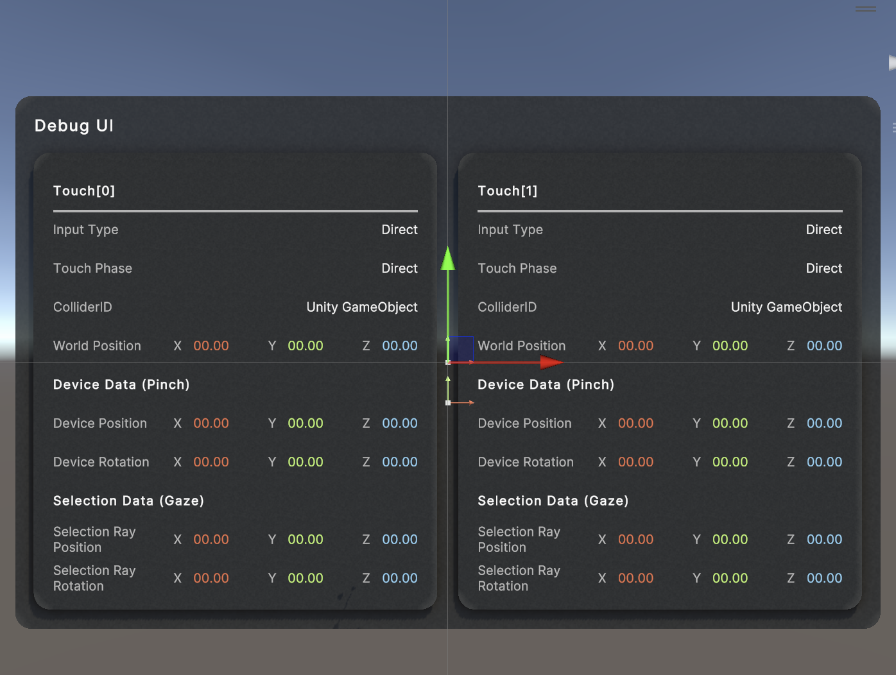
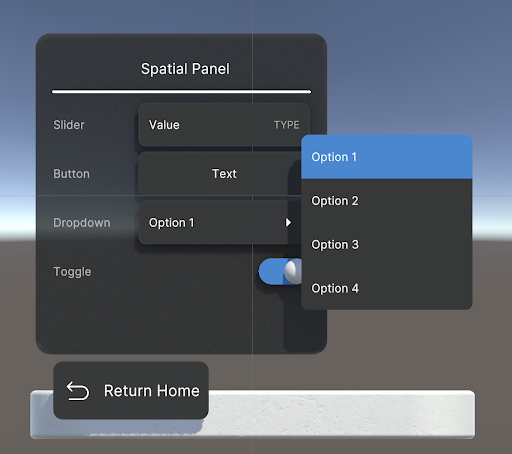

# Bounded Volume samples

## Balloon Gallery

The **Balloon Gallery** is a mini-game that demonstrates targeted input using **Indirect Pinch and Direct (Poke)** input to target content in a bounded volume scene.

 

## Character Walker

The **Character Walker** is a mini-game that demonstrates the ability to dynamically reposition the volume camera in a bounded volume. The Character Walker mini-game follows the character as it navigates an environment that is larger than the extent of the bounded volume.

 

## Input Data Visualization

The **Input Data Visualization** scene allows users to test various input types; **Direct (Poke), Direct Pinch, Indirect Pinch,** as well as analyze that data using the **Debug UI**.

 

## Manipulation

The **Manipulation** scene allows users to manipulate various objects with different colliders shapes within a bounded volume.

 

## Spatial UI

The **Spatial UI** scene gives users an example of a common spatial UI controls used in a bounded application. This includes elements such as a button, slider, toggle, and dropdown.

 

## Project Launcher

The **Project Launcher** scene allows users to launch various Unity scenes from a bounded volume using a carousel style spatial UI.

 
