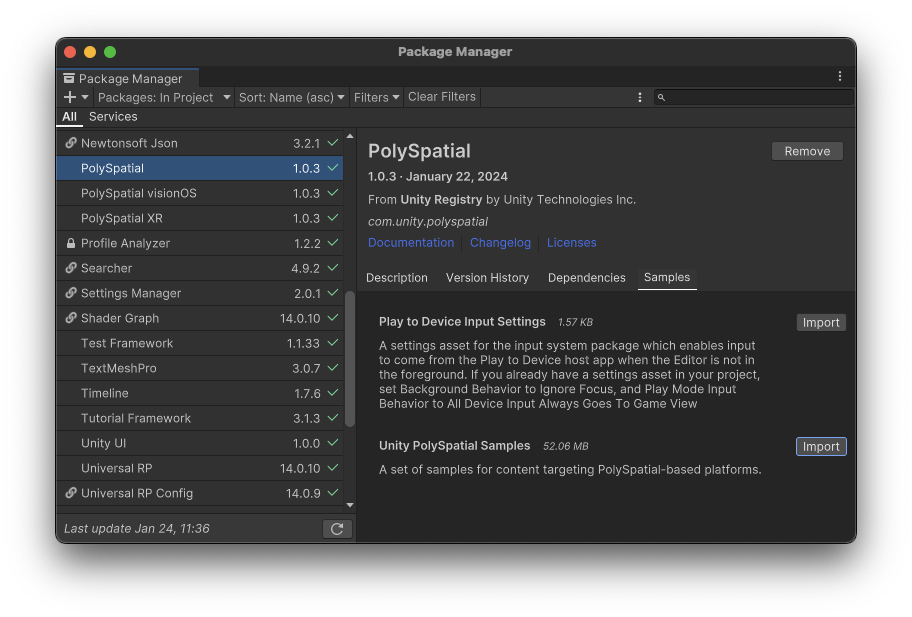
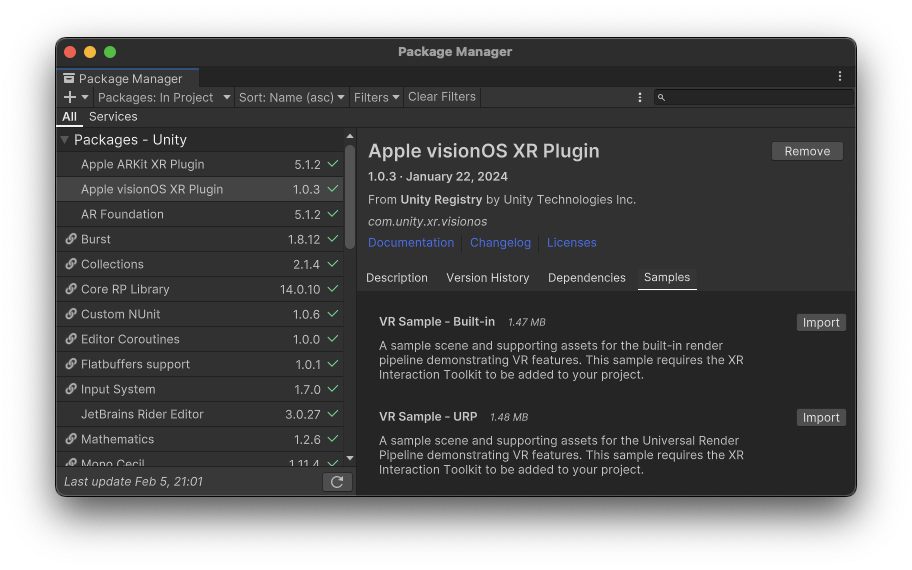

# Import visionOS samples

## Prerequisites

Before you import the visionOS samples, you must first:

* Install the visionOS platform module with the Unity Hub.
* Create a project in a supported version of the Unity Editor (Unity 2022.3 with patch version 18f+ recommended).
* Install the PolySpatial and visionOS packages.

Refer to [Install PolySpatial and visionOS support](install.md) for instructions.

## Import the RealityKit samples

To import the samples for the **RealityKit with PolySpatial** and **Hybrid - Switch between Metal and RealityKit** **App Modes** into your project:

1. In the Unity Editor, open the Package Manager window (menu: **Window &gt; Package Manager**).
2. Select the PolySpatial package (com.unity.polyspatial) from the list of packages in your project.

   

3. Select the **Samples** tab to show the samples available for the package.
4. Click the **Import** button for the **Unity PolySpatial Samples** item.
5. Set the **Default Volume Camera Window Configuration**  (menu: **Edit &gt; Project Settings &gt; PolySpatial**) to use the configuration in `Assets/Samples/PolySpatial/Resources/Bounded_VolumeCameraConfiguration.asset`.

Unity imports the PolySpatial samples into your project. You can find these samples in the **Assets &gt; Samples &gt; PolySpatial** folder.

## Import the virtual reality samples

To import the samples for the **Virtual Reality - Fully Immersive Space** **App Mode** into your project:

1. In the Unity Editor, open the Package Manager window (menu: **Window &gt; Package Manager**).
2. Select the Apple visionOS XR Plugin package (com.unity.xr.visionos) from the list of packages in your project.

   

3. Select the **Samples** tab to show the samples available for the package.
4. Click the **Import** button for either the **Metal Sample - Built-in** or the **Metal Sample - URP** item, depending on which rendering pipeline the project uses.

Unity imports the Metal sample into your project. You can find the sample in the **Assets &gt; Samples &gt; Apple visionOS XR Plugin** folder.