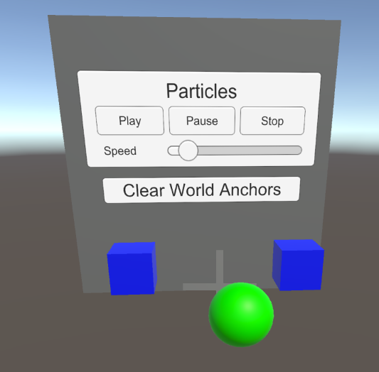

# VR samples

The **Apple visionOS XR Plugin** provides two samples that demonstrate how to set up a VR scene for the visionOS platform. One sample uses the Built-in Rendering Pipeline and the other uses the Universal Rendering Pipeline (URP). The samples are otherwise the same.

The VR samples use the following, additional packages:

* [XR Interaction Toolkit](https://docs.unity3d.com/Packages/com.unity.xr.interaction.toolkit@latest?subfolder=/manual/installation.html): The XR Interaction Toolkit package is a high-level, component-based, interaction system for creating VR, MR, and AR experiences.
* [XR Hands](https://docs.unity3d.com/Packages/com.unity.xr.handslatest?subfolder=/manual/project-setup/install-xrhands.html): The XR Hands package provides access to hand tracking data from ARKit on visionOS.

The **XR Interaction Toolkit** is required by the sample scenes, but the **XR Hands** package is optional. You can find instructions on how to install these packages at the links above.

## Scene elements

The [ARSession](xref:arfoundation-session) and [ARInputManager](xref:arfoundation-session#ar-input-manager) components must exist in all VR scenes on visionOS. These components are required because the visionOS platform provides head and hand tracking data through Apple's ARKit. These components can be on any GameObject in your scene, but only one of each should be present. In the VR Sample scene, the components are on the GameObject named "AR Session." In addition to head and hand tracking data, ARKit on visionOS provides world meshes, planes, and image markers tracked by the device.

> [!NOTE]
> On visionOS, Apple ARKit features are implemented by the [Apple visionOS XR Plugin](https://docs.unity3d.com/Packages/com.unity.xr.visionos@latest) package (com.unity.xr.visionos). You do not need the [Apple ARKit](https://docs.unity3d.com/Packages/com.unity.xr.arkit@latest) package (com.unity.xr.arkit), which implements ARKit features for iOS.

The [XR Origin](xref:xr-core-utils-xr-origin) collection of GameObjects and components serves as the center of tracking space. It includes the camera that renders the scene from the user's point of view. Any GameObjects whose position is controlled by tracking data, including the main camera, hand representations, meshes, planes, and the like, must be children of the Camera Offset GameObject within the XR Origin hierarchy. (If you place such objects elsewhere in the scene hierarchy, tracked objects won't be positioned correctly relative to the user.)

The **Anchor Placer** GameObject has a sample script that places an [ARAnchor](xref:arfoundation-anchors#anchoring-content) in the scene using the [VisionOSSpatialPointer](xref:UnityEngine.XR.VisionOS.InputDevices.VisionOSSpatialPointerControl).

The **XRI** GameObject is the parent of a set of GameObjects that use the [XR Interaction Toolkit](https://docs.unity3d.com/Packages/com.unity.xr.interaction.toolkit@latest), These include:

* [XR Interaction Manager](https://docs.unity3d.com/Packages/com.unity.xr.interaction.toolkit@latest?subfolder=/manual/xr-interaction-manager.html): contains the manager component that manages interactions.
* [Grab Interactable Left and Right](https://docs.unity3d.com/Packages/com.unity.xr.interaction.toolkit@latest?subfolder=/manual/xr-grab-interactable.html): a pair of example objects to serve as interactable objects.
* [Ray Interactor](https://docs.unity3d.com/Packages/com.unity.xr.interaction.toolkit@latest?subfolder=/manual/xr-ray-interactor.html): contains the interactor components that let the user interact with the UI and the left and right grab interactables. The ray cast used for this interactor is controlled by the position and orientation of the [VisionOSSpatialPointer](xref:UnityEngine.XR.VisionOS.InputDevices.VisionOSSpatialPointerControl).
* **Ray Origin**: visualizes the ray projected by the **Ray Interactor** using a [TrackedPoseDriver](xref:UnityEngine.InputSystem.XR.TrackedPoseDriver) set up to track the [VisionOSSpatialPointer](xref:UnityEngine.XR.VisionOS.InputDevices.VisionOSSpatialPointerControl).

The **Sample Canvas** provides an example UI with a few controls that alter the behavior of a particle system and a button to clear any anchors the user has placed. The components used for the UI are the same as you might use in any Unity project, with the exception of the [Tracked Device Graphic Raycaster](xref:UnityEngine.XR.Interaction.Toolkit.UI.TrackedDeviceGraphicRaycaster) component from the **XR Interaction Toolkit**. This component implements a custom [GraphicRaycaster](xref:UnityEngine.UI.GraphicRaycaster) for tracked devices.

The **Event System** GameObject the standard [EventSystem](xref:UnityEngine.EventSystems.EventSystem) component that handles UI events in a scene and the [XRUIInputModule](xref:UnityEngine.XR.Interaction.Toolkit.UI.XRUIInputModule) component that adapts XR input to the Event System. Refer to [UI interaction setup](xref:xri-ui-setup) **XR Interaction Toolkit** manual for more information about configuring UI interaction in XR.

> [!IMPORTANT]
> Do not use the **Standalone Input Module** or **Input System UI Input Module** components in an XR scene. These other UI Input Modules are not compatible with the XR input and might cause undesired or unexpected behavior. Only use a single, XR UI Input Module to handle UI interactions.
