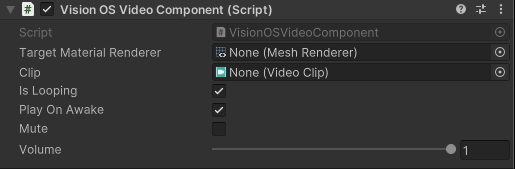

# Video Player components
You can use either of two components to display video content on visionOS with PolySpatial:

- [VisionOSVideoComponent](#visionosvideocomponent)
- [VideoPlayer](#video-player)

Although either component can play video on visionOS, each component has advantages and disadvantages to consider.

## VisionOSVideoComponent

In order to support video content on visionOS, PolySpatial currently includes a custom `VisionOSVideoComponent`. To use it, add the component to a GameObject and set its properties. The `Target Material Renderer` property identifies the `MeshRenderer` that will display the video content. Any MeshRenderer can be used. `Source` determines whether the video component will load the asset from a video clip reference or from an URL.

If the video is sourced from a clip, the `Clip` property identifies the `Video Clip` asset that you want to play, such as an `.mp4`. The clip must be manually copied into a `../StreamingAssets/VisionOSVideoClips/` folder to display and render properly on visionOS. This folder must be relative from the project folder - for example, the full folder path may be `Assets/StreamingAssets/VisionOSVideoClips/`. Create this folder if it does not exist. Ensure that the clip is not just moved into this folder, but copied into it, so that there are two instances of it - one referenced by the `VisionOSVideoComponent` and one under the `StreamingAssets` folder. Refer to [Special folder names](xref:SpecialFolders) and [Streaming Assets](xref:StreamingAssets) for more information about the Unity `StreamingAssets` folder.

Refer to Unity documentation on the `StreamingAssets` folder for more information.

If the video is sourced from an URL, the video component will attempt to load the video asset detailed in the `Url` property. The URL can be an absolute URL, with a scheme prefix (file, http), or it can just be the name of the video asset and the extension (e.g. "videoclip.mov"). In the latter case, the component will attempt to search for the video asset within the mainBundle of the Xcode project. Note that if the video is being sourced from an URL, there is no need to copy the video clip asset into the `StreamingAssets` folder.

If the video asset cannot be found, then the video component won't be modified - if it was playing a prior video, it will continue to do so. On visionOS, the component will send a warning that the video asset could not be found. If previewing your app on editor, no such warning will be emitted.

A video player can be prerolled, which allows for loading media data in an attempt to prime the player and video clip for smooth playback. There are some differences with this property between Unity Editor and visionOS. On visionOS, prerolling can only be done on a new `VisionOSVideoComponent` (i.e. it won't work on a player that simply changes video clip), and requires the player to be stopped before prerolling. This means that `PlayOnAwake` will have to be disabled. When this option is enabled, scripts can subscribe to event `VideoClipStateChanged` to get a notification of when prerolling is complete, and whether it was a success.

On Unity Editor, there is no need to disable `PlayOnAwake`. The player will have to actually be playing in order to get the callback - so `PlayOnAwake` should be set to enabled, or `Play()` should be manually called. Switching the video clip will result in the event `VideoClipStateChanged` being invoked.

The `VisionOSVideoComponent` component exposes the following properties:

| **Property**               | **Description**                                                                                                                                                                                                                                                         |
|----------------------------|-------------------------------------------------------------------------------------------------------------------------------------------------------------------------------------------------------------------------------------------------------------------------|
| **Source**                 | Determines whether `VisionOSVideoComponent` attempts to load the video clip asset from a clip reference or from an URL. If `VisionOSVideoComponent` is loading the video clip from an URL, there is no need for the clip to be present in the `StreamingAssets` folder. |
| **Url**                    | Path to the video asset. This can be an absolute path to an asset, or it can just be the name of the asset and the extension (for example, "videoclip.mov").                                                                                                            |
| **Clip**                   | The video clip asset to be played. The clip asset must also be copied into the `StreamingAssets` folder.                                                                                                                                                                |
| **TargetMaterialRenderer** | Reference to the `MeshRenderer` on which the video should render. The video will overwrite the current material on that `MeshRenderer`.                                                                                                                                 |
| **IsLooping**              | Whether the video should repeat when playback reaches the end of the clip.                                                                                                                                                                                              |
| **PlayOnAwake**            | Whether the video should start playing when `Awake()` is called.                                                                                                                                                                                                        |
| **RequestPreroll**         | When true, `VisionOSVideoComponent` will attempt to load media data and prime the media pipeline for playback. This is a request, and is not guaranteed to work in all cases                                                                                            |
| **Mute**                   | When true, audio playback is suppressed; when false, the volume value is respected.                                                                                                                                                                                     |
| **Volume**                 | The current volume of audio playback for the clip, ranging between 0 and 1.                                                                                                                                                                                             |

At runtime, you can use the following methods to control video playback:

| **Method**                   | **Description**                                                                                                 |
|------------------------------|-----------------------------------------------------------------------------------------------------------------|
| **GetState()**               | Get current state of the video player.                                                                          |
| **Play()**                   | Starts playback.                                                                                                |
| **Stop()**                   | Stops the playback and sets the current playback time to 0.                                                     |
| **Pause()**                  | Pauses the playback and leaves the current playback time intact.                                                |
| **GetDirectAudioMute()**     | Get the direct-output audio mute status for the specified track - note that currently only track index 0 works. |
| **SetDirectAudioMute()**     | Set the direct-output audio mute status for the specified track - note that currently only track index 0 works. |
| **GetDirectAudioVolume()**   | Get the direct-output audio volume for the specified track - note that currently only track index 0 works.      |
| **SetDirectAudioVolume()**   | Set the direct-output audio volume for the specified track - note that currently only track index 0 works.      |

## VisionOSVideoComponent events

`VisionOSVideoComponent` has the following events that can be subscribed to:

`VideoClipStateChanged` An event that represents the state of the video clip asset on visionOS. This event will be triggered if the clip cannot be found, if the clip failed to preroll, or if the clip successfully prerolled.

## Unity Video Player support

You can use Unity's default `VideoPlayer` component to play video on visionOS with Unity Editor version `2022.3.18f1` and above. To use this component with PolySpatial you must:
* Set the `VideoPlayer` `Render Mode` to `Render Texture`, and then supply the video player with a [RenderTexture](xref:psl-vos-render-textures) as a target texture.
* Apply this render texture to a material, and apply the material to a renderer as normal.
* Add a script that will call `PolySpatialObjectUtils.MarkDirty()` on the render texture attached to the VideoPlayer. This `PolySpatialObjectUtils.MarkDirty()` call should be called once per frame. Refer to the [RenderTexture](xref:psl-vos-render-textures) documentation for more information on manually dirtying RenderTextures.

Setting the `Render Mode` property on the `VideoPlayer` component to anything but `Render Texture` will result in a warning and the `VideoPlayer` will not render anything.

## Video Player vs VisionOS Video Component

There are tradeoffs that come with choosing one video component over the other.

The `VisionOSVideoComponent` utilizes visionOS's native video player to display and render video, allowing it to display video in a performant manner. More importantly, the `VisionOSVideoComponent` is also capable of playing 3D spatial video (MV-HEVC video) in visionOS. However, the public API for this component is much more limited than that of the normal VideoPlayer component, and more complex video player functionality (such as Events and Delegates) cannot be used with it. Additionally, because the video texture is created in visionOS, there is no access to that video texture through Unity. Additionally, the `VisionOSVideoComponent` will not work with debugging tools like PlayToDevice.

Using the normal `VideoPlayer` component comes with performance costs, because it must update the render texture each frame, but has the advantage of being able to utilize all of the Unity Video Player's extensive methods, events, and delegates. Additionally, you have access to the video texture and can use it like any other texture - for example, using it in a shader graph material. Using the normal `VideoPlayer` component also allows streaming over a network, and works with [Play To Device](xref:psl-play-to-device).
