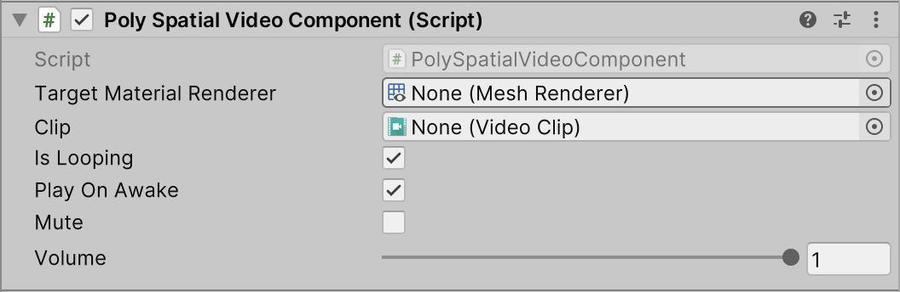

# PolySpatial Video Component
In order to support video content on visionOS, PolySpatial currently includes a custom `PolySpatialVideoComponent`. We expect to eventually support the stock video component, but this component provides key video functionality for visionOS in the interim. To use it, set the `Target Material Renderer` to the `GameObject` on whose `MeshRenderer` you want to display the video, and set `Clip` to point at the video asset you want to play, such as an `.mp4`

A limitation of the current system is that the clip must be manually copied into a `../StreamingAssets/PolySpatialVideoClips/` folder for full functionality on visionOS. Create this folder if it does not exist. Ensure that the clip is not just moved into this folder, but copied into it, so that there are two instances of it.

The `PolySpatialVideoComponent` component exposes the following properties:

| **Property** | **Description** |
| --- | --- |
| **TargetMaterialRenderer** | Reference to the MeshRenderer on which the video should render. The video will overwrite the current material on that MeshRenderer. |
| **Clip** | The video asset to be played. |
| **IsLooping** | Whether the video should repeat when playback reaches the end of the clip. |
| **PlayOnAwake** | Whether the video should start playing when `Awake()` is called.|
| **Mute** | When true, audio playback is suppressed; when false, the volume value is respected. |
| **Volume** | The current volume of audio playback for the clip, ranging between 0 and 1. |

| **Method**                   | **Description** |
|------------------------------| --- |
| **GetState()**               | Get current state of the video player.|
| **Play()**                   | Starts playback. |
| **Stop()**                   | Stops the playback and sets the current time to 0. |
| **Pause()**                  | Pauses the playback and leaves the current time intact. |
| **GetDirectAudioMute()**     | Get the direct-output audio mute status for the specified track - note that currently only track index 0 works. |
| **SetDirectAudioMute()**     | Set the direct-output audio mute status for the specified track - note that currently only track index 0 works. |
| **GetDirectAudioVolume()**   | Get the direct-output audio volume for the specified track - note that currently only track index 0 works. |
| **SetDirectAudioVolume()**   | Set the direct-output audio volume for the specified track - note that currently only track index 0 works. |

