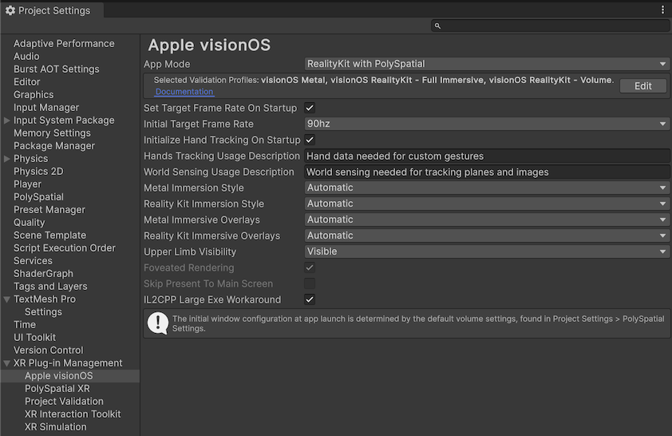

# visionOS Settings

To access the visionOS Settings window, go to: `Edit > Project Settings > XR Plug-in Management > Apple visionOS` in the Unity Editor.

The following settings are available:

| **Property**                                                           | **Description**                                                                                                                                                                                                                                                                                                                                                                                                                                                       |
|:-----------------------------------------------------------------------|:----------------------------------------------------------------------------------------------------------------------------------------------------------------------------------------------------------------------------------------------------------------------------------------------------------------------------------------------------------------------------------------------------------------------------------------------------------------------|
| **App Mode**                                                           | Defines the initial mode of the application.                                                                                                                                                                                                                                                                                                                                                                                                                          |
| &nbsp;&nbsp;&nbsp;&nbsp;*Metal Rendering with Compositor Services*     | For [Metal-based apps](MetalApps.md) the rendering and simulation are entirely managed by Unity, resulting in low overhead. This mode allows the quickest path to port existing XR applications to visionOS.                                                                                                                                                                                                                                                          |
| &nbsp;&nbsp;&nbsp;&nbsp;*RealityKit with PolySpatial*                  | In the [RealityKit with PolySpatial](RealityKitApps.md) mode, apps are simulated with Unity, but rendered with RealityKit, the system renderer of visionOS. This allows apps to take full advantage of visionOS's capabilities.                                                                                                                                                                                                                                       |
| &nbsp;&nbsp;&nbsp;&nbsp;*Windowed - 2D Window*                         | The [Windowed](WindowedApps.md) app mode allows apps to create and use windows, that can be used to present 2D or 3D content, similar to traditional windowed content. This mode can provide a quick path to port existing windowed apps to visionOS.                                                                                                                                                                                                                 |
| &nbsp;&nbsp;&nbsp;&nbsp;*Hybrid - Switch between Metal and RealityKit* | [Hybrid](PolySpatialHybridApps.md) apps can switch between Metal and RealityKit modes at runtime, allowing them to blend content from each mode together.                                                                                                                                                                                                                                                                                                             |
| **Set Target Fame Rate On Startup**                                    | Whether the target frame rate and frame repeat count should be set when the application begins.                                                                                                                                                                                                                                                                                                                                                                       |
| **Initial Target Frame Rate**                                          | This value is used to set the application frame rate and its minimum repeat frame count at startup. If the application is experiencing frame drops or cannot reliably render in a higher frame rate, you can try to reduce this value to have more consistent frame rates.                                                                                                                                                                                            |
| &nbsp;&nbsp;&nbsp;&nbsp;*90hz*                                         | The default frame rate for visionOS apps. The application is expected to render within the 11 milliseconds available per frame.                                                                                                                                                                                                                                                                                                                                       |
| &nbsp;&nbsp;&nbsp;&nbsp;*45hz*                                         | The application is expected to render within the 22 milliseconds available per frame.                                                                                                                                                                                                                                                                                                                                                                                 |
| &nbsp;&nbsp;&nbsp;&nbsp;*33hz*                                         | The application is expected to render within the 33 milliseconds available per frame.                                                                                                                                                                                                                                                                                                                                                                                 |
| **Initialize Hand Tracking On Startup**                                | Initializes hand tracking when the application starts up.                                                                                                                                                                                                                                                                                                                                                                                                                 |
| **Hands Tracking Usage Description**                                   | The text to show to users when hand tracking authorization is requested. If your app does not use hand tracking, you can safely leave this field blank.                                                                                                                                                                                                                                                                                                               |
| **World Sensing Usage Description**                                    | The text to show to users when world sensing authorization is requested. World sensing usage description is required if world sensing features (images, planes, or meshes) will be used. If this field is blank, the app will not be allowed to request world sensing authorization, and will crash when trying to start an AR Session using these data providers.                                                                                                    |
| **Metal Immersion Style**                                              | Defines the immersion style to be used in Metal-based apps. Immersion style determines whether an app will have pass-through. For Metal-based apps, only two immersion styles are valid - **Mixed** and **Full**. The **Progressive** immersion style is not supported with Metal-based apps.                                                                                                                                                                         |
| &nbsp;&nbsp;&nbsp;&nbsp;*Automatic*                                    | For Metal-based apps, choosing **Automatic** will cause the app to fallback to **Mixed** immersion style.                                                                                                                                                                                                                                                                                                                                                             |
| &nbsp;&nbsp;&nbsp;&nbsp;*Full*                                         | With this immersion style, pass-through is disabled, and only the skybox will be shown.                                                                                                                                                                                                                                                                                                                                                                               |
| &nbsp;&nbsp;&nbsp;&nbsp;*Mixed*                                        | With this immersion style, apps will have pass-through video feed. This immersion style allows an app to switch at runtime between allowing pass-through and rendering the skybox.                                                                                                                                                                                                                                                                                    |
| **RealityKit Immersion Style**                                         | Defines the immersion style to be used in RealityKit-based apps. Immersion style determines whether your application will have pass-through. Although all immersion styles are applicable to RealityKit-based apps, the effects of some immersion styles will differ depending on the **VolumeCamera** **Mode**.                                                                                                                                                      |
| &nbsp;&nbsp;&nbsp;&nbsp;*Automatic*                                    | For RealityKit-based apps, choosing **Automatic** will cause the app to fallback to **Mixed** immersion style.                                                                                                                                                                                                                                                                                                                                                        |
| &nbsp;&nbsp;&nbsp;&nbsp;*Full*                                         | If all **VolumeCamera**s are set to **Bounded** **Mode**, content will still appear with pass-through, as if the app was in **Mixed** immersion style. If one **VolumeCamera** in the scene is set to **Unbounded** **Mode**, pass-through will be disabled and replaced with a black background, and only content will be visible. The **Digital Crown** will have no effect.                                                                                        |
| &nbsp;&nbsp;&nbsp;&nbsp;*Mixed*                                        | With this immersion style, apps will have pass-through video feed. **VolumeCamera** **Mode** will have no effect on this immersion style.                                                                                                                                                                                                                                                                                                                             |
| &nbsp;&nbsp;&nbsp;&nbsp;*Progressive*                                  | If all **VolumeCamera**s are set to **Bounded** **Mode**, content will still appear with pass-through, as if the app was in **Mixed** immersion style. If one **VolumeCamera** in the scene is set to **Unbounded** **Mode**, content will appear inside a radial portal with a black background. See [Progressive Immersion](RealityKitApps.md#progressive-immersion) for more details.                                                                              |
| **Metal Immersion Overlays**                                           | The visibility of persistent system overlays (such as the visionOS hand gesture menus) in Metal immersive spaces.                                                                                                                                                                                                                                                                                                                                                     |
| &nbsp;&nbsp;&nbsp;&nbsp;*Automatic*                                    | The element may be visible or hidden depending on the policies of the component accepting the visibility configuration.                                                                                                                                                                                                                                                                                                                                               |
| &nbsp;&nbsp;&nbsp;&nbsp;*Visible*                                      | The element may be visible.                                                                                                                                                                                                                                                                                                                                                                                                                                           |
| &nbsp;&nbsp;&nbsp;&nbsp;*Hidden*                                       | The element may be hidden.                                                                                                                                                                                                                                                                                                                                                                                                                                            |
| **RealityKit Immersion Overlays**                                      | The visibility of persistent system overlays (such as the visionOS hand gesture menus) in RealityKit immersive spaces.                                                                                                                                                                                                                                                                                                                                                |
| &nbsp;&nbsp;&nbsp;&nbsp;*Automatic*                                    | The element may be visible or hidden depending on the policies of the component accepting the visibility configuration.                                                                                                                                                                                                                                                                                                                                               |
| &nbsp;&nbsp;&nbsp;&nbsp;*Visible*                                      | The element may be visible.                                                                                                                                                                                                                                                                                                                                                                                                                                           |
| &nbsp;&nbsp;&nbsp;&nbsp;*Hidden*                                       | The element may be hidden.                                                                                                                                                                                                                                                                                                                                                                                                                                            |
| **Upper Limb Visibility**                                              | This option allows for controlling whether the hands are visible within the app. This option is ignored if the **App Mode** is Windowed, or if the **App Mode** is set to RealityKit but the scene consists of only **Bounded** **VolumeCamera**s.                                                                                                                                                                                                                   |
| &nbsp;&nbsp;&nbsp;&nbsp;*Automatic*                                    | Hands visibility will be determined by visionOS's default hands setting, which will depend on the context.                                                                                                                                                                                                                                                                                                                                                            |
| &nbsp;&nbsp;&nbsp;&nbsp;*Visible*                                      | In **Metal** **App Mode**, the hands will always be visible in the app. Hands always render on top of virtual content. In **RealityKit** **App Mode**, the hands are blended with virtual content based on depth.                                                                                                                                                                                                                                                     |
| &nbsp;&nbsp;&nbsp;&nbsp;*Hidden*                                       | In **Metal** **App Mode**, the hands will be hidden, which may be beneficial if you wish to present virtual hands instead. In **RealityKit** **App Mode**, the hands will be displayed behind virtual content.                                                                                                                                                                                                                                                        |
| **Foveated Rendering**                                                 | This option controls whether foveated rendering is enabled or disabled. This option only applies to Metal-based content, and requires the Universal Render Pipeline.                                                                                                                                                                                                                                                                                                  |
| **Skip Present To Main Screen**                                        | Enables the **SkipPresentToMainScreen** XR setting. This setting was previously disabled to work around an issue that caused Unity versions prior to 6000.0.11f1 to leak GPU resources. In Unity 6000.0.11f1 and above, enabling this setting will fix a known issue with frame pacing on visionOS. Do not modify this setting from its default value unless you have a specific reason. It should be enabled on Unity 6000.0.11f1 and above, and disabled otherwise. |
| **IL2CPP Large Exe Workaround**                                        | When building your project in Xcode, you may encounter an error such as `ARM64 branch out of range`, especially with larger projects. This option will patch the project to work around this error.                                                                                                                                                                                                                                                                   |
