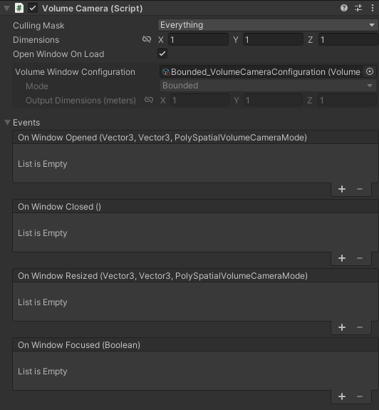

# Volume cameras

PolySpatial provides a new Unity component called a **Volume Camera**, which determines how Unity apps interact with the modes and volumes of visionOS. Volume cameras are similar to regular Unity cameras in that they specify what portion of your Unity scene will be visible and interactable to a user. However, while traditional cameras flatten 3D content into 2D images, Volume Cameras preserve the 3D nature of the content they capture. Just as traditional cameras are associated with a 2D viewport or texture, volume cameras are associated with a (3D) volume window.

Volume cameras support both **Bounded** and **Unbounded** modes. When a volume camera's **Mode** is set to **Unbounded**, your entire Unity scene is shown in a visionOS Immersive Space.

In contrast, a camera in **Bounded** mode corresponds to a visionOS Volume Window, and only content contained within the camera's bounding box appears inside your Volume Window. Unity content inside a volume camera's bounds is scaled up or down to fit inside its Volume Window, and objects that overlap the window boundary are subject to GPU clipping. The **VolumeCamera** component displays preview bounds in the Scene view to help visualize what content will be rendered in this mode.

You can alter or animate a volume camera's transform and dimensions to dynamically change which subregion of your scene will appear inside its associated visionOS Volume Window. However, to switch between modes or to alter the size of the volume window itself, you must change the [Volume Camera Window Configuration](#volume-camera-window-configuration-assets) referenced by the volume camera. You cannot modify the properties of a Volume Camera Window Configuration at runtime.

## Volume camera properties

The **VolumeCamera** component exposes the following properties:

| **Property**                    | **Description**      |
| :------------------------------ | :------------------- |
| **CullingMask**                 | Defines a bitmask of Unity layers. Only objects belonging to the specified layers are displayed by the volume camera. You can use the CullingMask to specify which objects the volume camera should display. To be visible in a **Bounded** volume, the GameObjects must also be within the volume camera's bounding box (as specified by its **Dimensions** property and transform scale. Refer to [Layers](xref:Layers) for more information about layers and layer masks in Unity. |
| **Dimensions**                  | Defines the (unscaled) size of the camera's bounding box. When you set the volume camera **Mode** to **Bounded**, the camera only displays GameObjects within the scaled bounding box. The bounding box is centered at the position of the **VolumeCamera**’s transform. The world space dimensions of the bounding box are calculated by multiplying the **Dimensions** by the transform's scale. The **Dimensions** are ignored when you set the **Mode** to **Unbounded**, because there is no bounding box in that mode. |
| **Open Window On Load**         | If enabled, the volume camera opens its volume automatically when loaded. Otherwise, you must open the volume manually using the [VolumeCamera.OpenWindow()](xref:Unity.PolySpatial.VolumeCamera.OpenWindow) method. |
| **Volume Window Configuration** | Defines the size and mode of the volume window to which the volume camera is connected. If you do not set a configuration, then the volume camera uses the configuration specified for **Default Volume Camera Configuration** in your [PolySpatial Settings](#volume-camera-polyspatial-settings) when it opens its volume window. |      

<!-- 
Removed this example from culling mask description because multiple VolumeCameras aren't supported yet. TODO: replace when multiple cameras are supported.
For example, you could render a 3D inventory within one volume by assigning the inventory GameObjects to an "inventory" layer, and use a "minimap" layer to render a bird's eye view of the entire scene within a second volume. 
-->

## Implementation details and intuitions

Just as a traditional camera specifies both a source size (field of view) and target size (viewport dimensions), a volume camera specifies both source dimensions and target dimensions. A volume camera's dimensions are somewhat akin to field of view: they define how much of the scene is visible. Likewise, its output dimensions are akin to viewport size: they determine how big the content appears to the user.

A volume camera maps content from a source oriented bounding box (OBB) within Unity to the corresponding target OBB of a visionOS Volume Window as follows:

The source OBB is centered and oriented according to the transform of the volume camera's GameObject, and its size is equal to its dimensions multiplied by the scale of its GameObject. All Unity content within this OBB will be replicated to visionOS. Adjusting the source dimensions is akin to zooming a camera in or out - it affects *both* how much content you see *and* how big that content will appear. The dimensions and transform of a volume camera can be freely modified during runtime.

The target OBB -- the visionOS volume window -- can only be positioned and rotated by a user or the OS, but its size is determined by the **Output Dimensions** of the Volume Camera's [Volume Camera Window Configuration](#volume-camera-window-configuration-assets). Changing the output dimensions *only* scales the real-world size of the final rendered content, *not* how much content is visible.

At runtime, you cannot change the dimensions of a bounded volume window directly. When you change the [Volume Camera Window Configuration](#volume-camera-window-configuration-assets) of a Volume Camera component to one with different **Output Dimensions**, PolySpatial replaces the existing volume window with a new one. 

## Volume camera events

The **VolumeCamera** has one event that can be subscribed to:

`OnWindowEvent` An event that is triggered when this volume camera's window changes state - in other words, it is triggered whenever the window is opened, closed, resized, receives focus, or loses focus. When a change has occurred, the event will supply a `WindowState` struct that encapsulates information on the window's state change.

The `WindowState` struct has the following properties:

| **Property**                           | **Description**      |
|:---------------------------------------| :------------------- |
| **WindowEvent**                        | The change in state that just occurred for this window. |
| &nbsp;&nbsp;&nbsp;&nbsp;*Opened*       | The volume camera window was opened. |
| &nbsp;&nbsp;&nbsp;&nbsp;*Resized*      | The volume camera window was resized. See the `OutputDimensions` and `ContentDimensions` to figure out what the volume camera window was resized to.|
| &nbsp;&nbsp;&nbsp;&nbsp;*Focused*      | The volume camera window either received focus or lost focus.|
| &nbsp;&nbsp;&nbsp;&nbsp;*Backgrounded* | The volume camera window was closed due to being backgrounded.|
| &nbsp;&nbsp;&nbsp;&nbsp;*Closed*       | The volume camera window was closed due to being dismissed.|
| **OutputDimensions**                   | The actual dimensions of the window in world space, or `Vector3.zero` if the volume is unbounded. |
| **ContentDimensions**                  | The actual dimensions of the content, which may be different due to aspect ratio mapping, in world space, or `Vector3.zero` if the volume is unbounded. |
| **Mode**                               | The mode this volume camera will display its content in, Bounded or Unbounded. |
| **IsFocused**                               | When windowEvent is set to `WindowEvent.Focused`, this will indicate whether it has received focus or lost it. |

The following table provides examples of the sequence in which `OnWindowEvent` is called when a volume window changes state because of a User or OS action. For example, when the OS opens a window while launching an app, `OnWindowEvent` is invoked twice, once with `WindowEvent.Opened`, and once with `WindowEvent.Resized`.

Note that these events may differ from backend to backend. The events listed below are when running an app on Vision OS. When running an app on the Unity editor, there are no `UnityEvent.Focused` events triggered, nor are there `UnityEvent.Backgrounded` events. 

Additionally, some of the ordering may be subject to change in the future, particularly **Changing the Volume Window Configuration**.

| **User / OS Actions**                             | **OnWindowEvents triggered (in order)**   |
|:--------------------------------------------------|:------------------------------------------|
| **Opening the app for the first time**            | WindowEvent.Opened |
| **Changing the `Volume Window Configuration`**     | WindowEvent.Closed WindowEvent.Opened WindowEvent.Resized                        |
| **Opening the Vision Pro's home view**            | WindowEvent.Focused, IsFocused = false    |
| **Bringing the app back into focus**              | WindowEvent.Focused, IsFocused = true     |
| **Tapping the `x` button next to the window bar** | WindowEvent.Focused, IsFocused = false WindowEvent.Backgrounded                  |
| **Reopening the app from the home view**          | WindowEvent.Opened WindowEvent.Focused, IsFocused = true     |

## Volume Camera Window Configuration assets

Because visionOS requires all possible Volume Window dimensions to be predeclared at build time, you must specify all Volume Window setups ahead of time as Volume Camera Window Configuration assets. To change the mode or size of your app's volume window, you must change your volume camera to reference a different (predefined) Volume Camera Window Configuration asset. You cannot modify the properties of Volume Camera Window Configurations at runtime.

Volume Camera Window Configuration assets support the following properties:

| **Property**                         | **Description**                                                                                                         |
| :----------------------------------- | :-----------------------------------------------------------------------------------------------------------------------|
| **Mode**                             | Whether the camera should restrict the rendered content to objects within its bounding box or be unbounded.           |
| &nbsp;&nbsp;&nbsp;&nbsp;*Bounded*    | The volume camera has finite bounds defined by its dimensions. |
| &nbsp;&nbsp;&nbsp;&nbsp;*Unbounded*  | The volume camera captures everything regardless of position, and the dimensions field is disabled and ignored. Setting the mode of a volume camera to Unbounded is equivalent to requesting your app switch to "exclusive" mode.|
| **Output Dimensions**                | For **Bounded** volumes, determines the size of the displayed volume in meters. For example, if you set the output dimensions to 3x3x3, the Volume Window opened in the app is a cube measuring 3 meters on each side. The content within the volume camera's bounding box is scaled to fill the Volume Window(Ignored for **Unbounded** volumes). |

> [!NOTE]
> The visionOS operating system is free to set the volume window dimensions as it sees fit. The actual window dimensions are reported in [OnWindowEvent](#volume-camera-events) when `WindowEvent` is Opened. 
 
Create volume camera configuration assets using the **Create** menu: **Assets &gt; Create &gt; PolySpatial &gt; Volume Camera Window Configuration**. You must store these assets within a folder named `Resources` and they must exist when you start the build -- they cannot be added as a build process or post-process. Refer to [Special Folder names](xref:SpecialFolders) for more information about `Resources` folders in Unity. All volume camera configuration assets that you intend to use must be included in the build. You cannot create them dynamically at runtime.

Once created, you can swap between configurations at runtime, but you cannot modify the output properties of a Volume Camera directly. You can only change these properties by referencing a different volume camera configuration asset.  

Switching between volume camera configurations is as easy as assigning a new volume camera configuration to your volume camera, either through script or through the inspector window.  It is possible to switch between an unbounded and a bounded volume configuration, and vice-versa.

If you do not assign a configuration asset to a volume camera, it uses the asset specified by the **Default Volume Camera Window Configuration** property of your project's **PolySpatial** settings. (To change this property, open the **Project Settings** window (menu **Edit &gt; Project Settings**) and select the **PolySpatial** section.)

## Volume camera PolySpatial settings

The general [PolySpatial Settings](PolySpatialSettings.md) include the following settings that pertain to volume cameras:

| **Setting**                             | **Description**                                                                                                                                            |
| :-------------------------------------- | :----------------------------------------------------------------------------------------------------------------------------------------------------------|
| **Default Volume Camera Configuration** | Defines the default **Volume Camera Configuration** asset that a volume camera uses to open its volume window if you have not assigned a configuration asset to the volume camera. If you do not identify a default configuration, any volume camera without a configuration attempts to open its volume window in **Unbounded** mode. This also determines the start-up scene for the application. For example, a project with the default Unbounded Volume Camera Window Configuration will start with an `ImmersiveSpace`, hiding other applications and the virtual environment. |
| **Auto-Create Volume Camera**           | When enabled, PolySpatial creates a volume camera automatically if there is no volume camera after scene load. Disable this property if you create the initial volume camera from a script after the scene loads. |

Access these settings in the **PolySpatial** section of your **Project Settings** (menu: **Edit &gt; Project Settings**).
