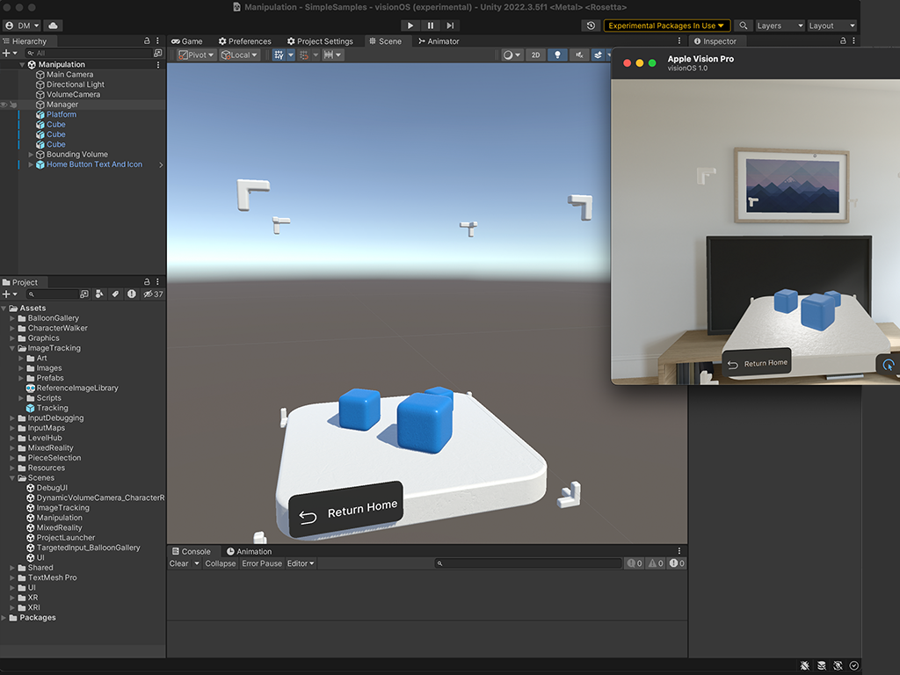

## Introduction
visionOS enables 3D multi-tasking experiences that seamlessly integrate with the real world and coexist alongside other virtual content. This opens a world of new possibilities around personal productivity, lifestyle and entertainment applications and a whole new market for developers. However, it also introduces new challenges around multitasking and interactions with the physical. Unity PolySpatial is a collection of technologies targetted to address this new platforms and its unique challenges  

## visionOS Platform Overview
You can find information about Unity's support for visionOS in the [visionOSPlatformOverview](visionOSPlatformOverview.md). 

### visionOS Application Types
Unity supports several different application types on visionOS, each with their own advantages:
* If you're interested in creating fully immersive virtual reality (VR) apps for visionOS, refer to [Fully Immersive VR apps on visionOS](VRApps.md) for more information.
* If you're interested in creating immersive mixed reality (MR) apps for visionOS, refer to [PolySpatial MR Apps on visionOS](PolySpatialMRApps.md) for more information. These apps are built with Unity's newly developed PolySpatial technology, where apps are simulated with Unity, but rendered with RealityKit, the system renderer of visionOS.
* If you're interested in creating content that will run in a window on visionOS, refer to [Windowed Apps on visionOS](WindowedApps.md) for more information.

## Resources
**New users** should find the [Getting Started](GettingStarted.md) page an ideal place for an introduction to visionOS and PolySpatial. It guides you through setup, prerequisites, iterating, previewing, building, and debugging with with [development and iteration](DevelopmentAndIteration.md) basics and building your first app for visionOS.

If you are **creating a new project** you can [build a project from scratch](TutorialCreateFromScratch.md), [use the project template](TutorialCreateFromTemplate.md), or [learn from sample content](Samples.md).

If you are **porting an existing project** you can find information about [porting VR experiences to visionOS](VRApps.md#porting-vr-experiences-to-visionos), find out which [Unity features and components](SupportedFeatures.md) are currently supported for immersive apps, or how to use [Project Validation](PolySpatialXRProjectValidation.md) for helpful in-editor assistance to port a project.

To **find answers and workarounds**, please consult the [FAQ](FAQ.md), which presents answers to many common questions about design, implementation, and use of the PolySpatial XR package.

For **in-depth technical information**, review the [Reference documentation](TableOfContents.md#reference-documentation).

The [Glossary](Glossary.md) can help clarify **technical terminology** introduced for visionOS and PolySpatial and used throughout this documentation.

## Table of Contents
You can find a comprehensive index of documentation in the [Table of Contents](TableOfContents.md)
