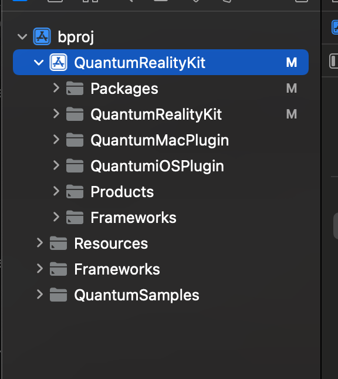

# PolySpatial RealityKit backend
There are three parts to this:

1. The C# PolySpatial RealityKit platform in this package.  This does very little; mostly focused around plugin initialization and connecting the Native API.

2. The `PolySpatialRealityKit` framework, which is the implementation of PolySpatial for RealityKit

3. Individual Mac (and soon iOS) Unity plugins that add window/input logic on top of `PolySpatialRealityKit`.

#### System Requirements
RealityKit requires macOS Monterey 12.3 or later, and Xcode 13 or later. Building a player on earlier versions will succeed, but the RealityKit window will not appear for failure to load the `PolySpatialMacPlugin` plugin.

#### Note on Legacy Process
1. *NOTE*: iOS is currently not functional, and will not build.
2. In the past, building for RealityKit required using the iOS target. Specifically, to run on Mac required an iOS build target running a Catalyst emulator. This is no longer the case; now, use the Mac build target to run locally on your mac laptop
3. It is not possible to build a player that uses the Unity PolySpatial backend on Mac.  (If you need to do this, force-disable the RealityKit platform by returning -1 from its priority method.)

## Mac Build Steps

There are three ways to build.  One doing a normal build from Unity, one having Unity generate an Xcode project and building from there with the binary plugin, and one where you set up the Xcode project to allow you to iterate quickly on the Swift/PolySpatialRealityKit code from within a single project.

### Without Xcode project
1. In Edit > Project Settings > PolySpatial, make sure "Enable PolySpatial Runtime" and "Enable PolySpatial in boot.config" are both true
2. Open Build Settings, and select "Windows, Mac, and Linux"
3. Press Build

### With Xcode project, and binary plugin

Due to a bug in Unity, some manual cleanup on the generated project is required.
1. In Edit > Project Settings > PolySpatial, make sure "Enable PolySpatial Runtime" and "Enable PolySpatial in boot.config" are both true
2. Open Build Settings, and select "Windows, Mac, and Linux"
3. Select Create Xcode Project
4. Press Build
5. Open the project, and expand the "Plugins" group and remove all of the red items ("Info", "CodeResources", "PolySpatialRealityKity", and "PolySpatialMacPlugin").
6. Select the project settings in the tree (the project itself), and open the General tab for the target.
7. Underneath Frameworks, press the "+" button, and navigate in the repo to "Packages/com.unity.polyspatial.visionos/Plugins".  Select the `PolySpatialMacPlugin` to add it to the Frameworks list.
8. You should be able to build.

### With Xcode project and PolySpatialRealityKit project
The Xcode project `Source~/PolySpatialRealityKit/PolySpatialRealityKit.xcodeproj` is a standalone project that builds the `PolySpatialRealityKit` framework and plugins. On Mac, it's possible to set up a single project to work on both Unity content and the RealityKit backend at the same time.

Follow instructions 1-5 from the previous "With Xcode project section".  Stop before adding the prebuilt plugin.  Then:

6. Drag the `PolySpatialRealityKit.xcodeproj` from the Finder into the Xcode project window, directly under the root.  (It lives in `com.unity.polyspatial.visionos/Source~/PolySpatialRealityKit`)  NOTE: this project must not be opened in Xcode directly.  If it is, you won't see a ">" next to it, and you'll need to close and reopen the project.
 

7. Select the top level/root project on the left side ("bproj" in the image)

8. Open "General" at the top of the large properties window.  Click the "+" under Frameworks and Libraries and select `PolySpatialMacPlugin.bundle` from the `PolySpatialRealityKit` project.

9. You should be able to build and run from Xcode, with Xcode compiling the PolySpatialRealityKit plugin as well.

If you make changes to PolySpatialRealityKit code, you should be able to just press Build/Run and have the changes take effect.

If you make changes on the Unity side, including C# changes or scene changes, make sure to select the "Append" option when building.  This will preserve your project structure and you will be able to just press Build/Run again.

## Using a specific RealityKit build

Make sure you're using a beta version of Xcode 14 (14.1 beta)

Follow the instructions from "With Xcode project and PolySpatialRealityKit project".  Then remove the `RealityKit` and `ARKit` framework references from the `PolySpatialRealityKit` project.  Open the project settings for `PolySpatialRealityKit` framework, and add `RealityKit.framework` and `RealityFoundation.framework` from your custom build.  Make sure "Embed & Sign" is selected (Or just "Embed only")
Check to make sure that the framework search path for the `PolySpatialRealityKit` target is updated to add the path to the RK drop you just referenced. If not, add it manually.

## Workarounds & Tips
- When you make a change, you need to rebuild the plugin(s) in this project.  This will also copy those built plugins to the right place in the package (the `Plugins/` subfolder).

- When checking in an update to a plugin, make sure you click back to Unity at least once after the copy happens.  There is a bug in Unity where it wants to generate `.meta` files for all files inside the plugins, which it shouldn't do.  Without letting it regenerate those, there would be a bunch of .meta file churn in your commits.

- If you run into a signing error in Xcode on a fresh Mac build, find the "Plugins" folder in the project navigator and delete PolySpatialMacPlugin.bundle (select "remove reference"). Make sure you've added the PolySpatialRealityKit.xcodeproj to your build project (as described above) and that you've added the PolySpatialMacPluginBundle *from* the PolySpatialRealityKit project to your "Frameworkes, Libraries, and embedded content.

- In Unity, in order to enable built players to only use the PolySpatial backed for output, enable the flag in Player Settings > PolySpatial.  On OSX, without this flag set, you will get both a Unity window and a RealityKit window, which can be helpful (in case you're wondering why there's no content in the Unity window -- remember there's the PolySpatial Camera stuff that disables that camera, if you want to see  content in both change your camera name to something else).  On iOS, without this flag set, you will get a regular Unity player.  With the flag set you will get a single window with PolySpatial RK output on both platforms.

- If you encounter crashes when running from Xcode, try disabling the Thread Performance Checker in the Diagnostics section of the Scheme settings.
